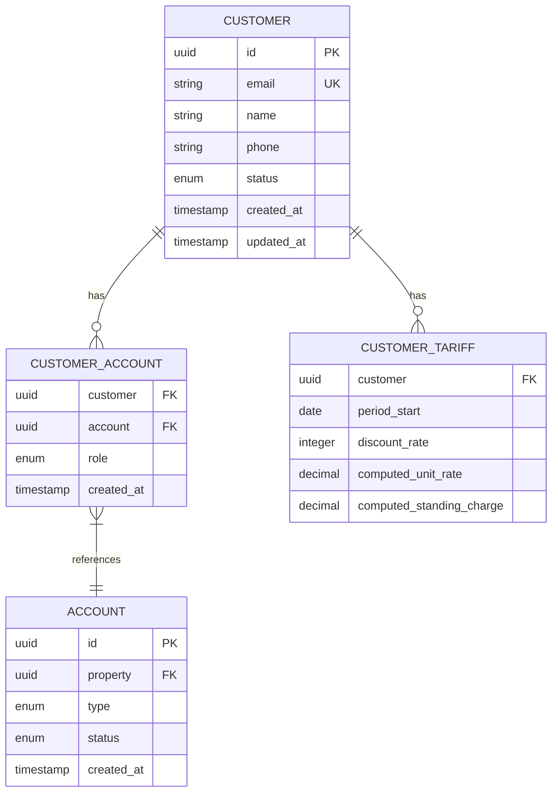
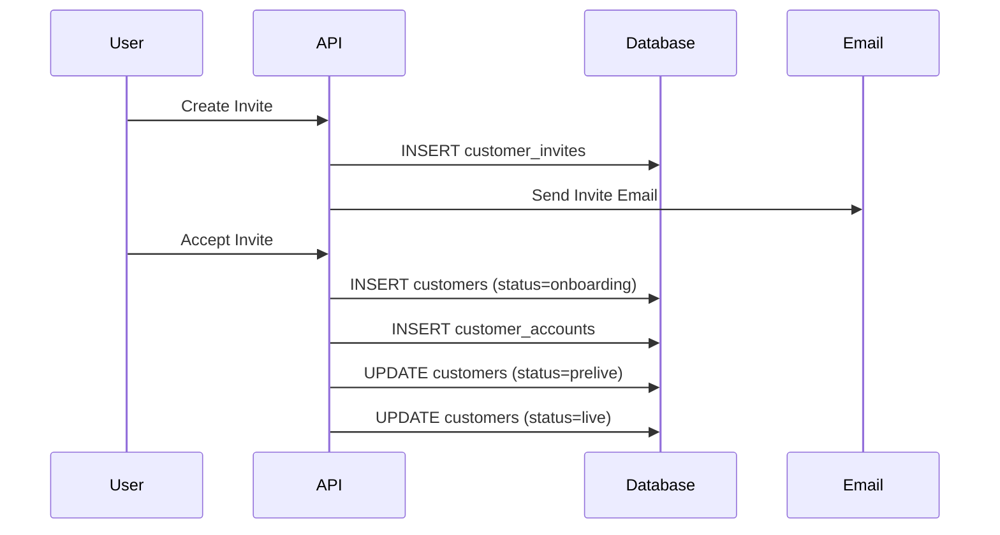
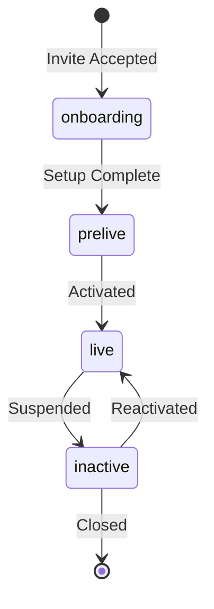

# Customer Management

The customer domain handles all aspects of customer lifecycle management, from onboarding to billing.

## Entity Model



## Core Tables

### customers

Primary customer record containing profile information.

| Column | Type | Description |
|--------|------|-------------|
| id | uuid | Primary key |
| email | varchar | Unique email address |
| name | varchar | Full name |
| phone | varchar | Contact number |
| status | enum | active, inactive, prelive, onboarding |
| created_at | timestamp | Registration date |
| updated_at | timestamp | Last modified |

**Status Values:**
- `onboarding` - Customer being set up
- `prelive` - Setup complete, awaiting activation
- `live` - Active customer
- `inactive` - Suspended or closed

### customer_accounts

Links customers to accounts with role-based access.

| Column | Type | Description |
|--------|------|-------------|
| customer | uuid | Customer ID (FK) |
| account | uuid | Account ID (FK) |
| role | enum | Relationship type |
| created_at | timestamp | Link created |

**Role Types:**
- `occupier` - Primary account holder
- `landlord` - Property owner
- `agent` - Managing agent
- `billing` - Billing contact

### customer_tariffs

Customer-specific tariff rates and discounts.

| Column | Type | Description |
|--------|------|-------------|
| customer | uuid | Customer ID (FK) |
| period_start | date | Effective date |
| discount_rate_basis_points | integer | Discount in basis points |
| computed_unit_rate | decimal | Calculated rate per kWh |
| computed_standing_charge | decimal | Daily standing charge |

## Key Operations

### Customer Onboarding



### Tariff Calculation

Customer tariffs are calculated based on:

1. **Benchmark Tariff** - Industry standard rates
2. **Microgrid Tariff** - Community-level adjustments
3. **Customer Discount** - Individual discounts

```sql
computed_unit_rate = benchmark_rate * (1 - discount_rate/10000)
computed_standing_charge = benchmark_standing * (1 - discount_rate/10000)
```

## API Endpoints

### List Customers
```http
GET /customers
```

Query parameters:
- `status=eq.live` - Filter by status
- `email=like.*@example.com` - Email pattern
- `select=id,email,name` - Select fields
- `order=created_at.desc` - Sort order

### Get Customer Details
```http
GET /customers?id=eq.{customer_id}
```

### Create Customer
```http
POST /customers
Content-Type: application/json

{
  "email": "customer@example.com",
  "name": "John Doe",
  "phone": "+44 20 1234 5678",
  "status": "onboarding"
}
```

### Update Customer
```http
PATCH /customers?id=eq.{customer_id}
Content-Type: application/json

{
  "status": "live"
}
```

### Get Customer Accounts
```http
GET /customer_accounts?customer=eq.{customer_id}&select=*,account(*)
```

### Get Customer Tariffs
```http
GET /customer_tariffs?customer=eq.{customer_id}&order=period_start.desc
```

## Business Rules

### Account Relationships

- A customer can have multiple accounts
- Each account must have at least one occupier
- Landlords cannot be occupiers of the same property
- Billing contacts receive all invoices

### Tariff Management

- New tariffs take effect from period_start date
- Only one tariff active per period
- Discounts are inherited from microgrid tariffs
- Customer-specific overrides are supported

### Status Transitions



## Data Validation

### Required Fields
- Email must be unique and valid format
- Name is required for live customers
- Phone number format validation

### Constraints
- Customer cannot be deleted if has accounts
- Status transitions must follow rules
- Tariff dates cannot overlap

## Audit & Compliance

### Event Tracking

All customer changes are logged in `customer_events`:
- Status changes
- Profile updates
- Account associations
- Tariff modifications

### GDPR Compliance

- Right to access - API endpoints for data export
- Right to rectification - Update endpoints
- Right to erasure - Soft delete with status
- Data minimization - Only required fields

## Common Queries

### Active Customers with Current Tariffs
```sql
SELECT 
    c.id,
    c.email,
    c.name,
    ct.computed_unit_rate,
    ct.computed_standing_charge
FROM customers c
LEFT JOIN LATERAL (
    SELECT * FROM customer_tariffs
    WHERE customer = c.id
    AND period_start <= CURRENT_DATE
    ORDER BY period_start DESC
    LIMIT 1
) ct ON true
WHERE c.status = 'live';
```

### Customers by ESCO
```sql
SELECT DISTINCT
    c.*,
    e.code as esco_code
FROM customers c
JOIN customer_accounts ca ON c.id = ca.customer
JOIN accounts a ON ca.account = a.id
JOIN properties p ON a.property = p.id
JOIN escos e ON p.esco = e.id
WHERE ca.role = 'occupier';
```