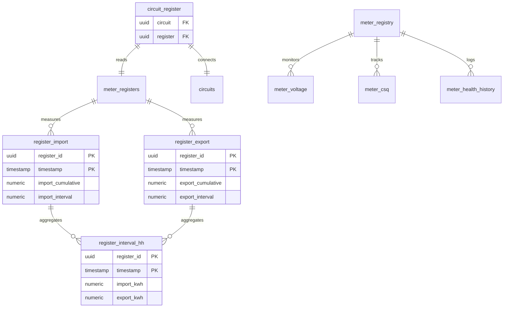

# Data Collection Domain

The Data Collection Domain handles continuous energy consumption monitoring, meter telemetry, and time-series data aggregation.

## Entity Relationship Diagram



## Core Tables

### register_import

Stores cumulative and interval import (consumption) readings.

**Key Fields:**
- `register_id` - Register UUID
- `timestamp` - Reading timestamp
- `import_cumulative` - Total cumulative reading (kWh)
- `import_interval` - Consumption since last reading (kWh)

**TimescaleDB Hypertable:**
- Partitioned by timestamp
- Automatic data compression after 7 days
- Retention policy configurable

**Usage:**
```sql
-- Get latest import reading
SELECT timestamp, import_cumulative, import_interval
FROM flows.register_import
WHERE register_id = '{{register_id}}'
ORDER BY timestamp DESC
LIMIT 1;

-- Daily consumption
SELECT DATE(timestamp) as day, 
       SUM(import_interval) as daily_kwh
FROM flows.register_import
WHERE register_id = '{{register_id}}'
  AND timestamp >= NOW() - INTERVAL '30 days'
GROUP BY DATE(timestamp)
ORDER BY day DESC;
```

### register_export

Stores export readings for generation (e.g., solar).

**Key Fields:**
- `register_id` - Register UUID
- `timestamp` - Reading timestamp
- `export_cumulative` - Total export reading (kWh)
- `export_interval` - Export since last reading (kWh)

**Usage:**
```sql
-- Solar generation today
SELECT SUM(export_interval) as solar_generation_kwh
FROM flows.register_export
WHERE register_id = '{{solar_register_id}}'
  AND timestamp >= DATE_TRUNC('day', NOW());
```

### register_interval_hh

Half-hourly aggregated consumption data.

**Key Fields:**
- `register_id` - Register UUID
- `timestamp` - Half-hour period start
- `import_kwh` - Import for this half-hour
- `export_kwh` - Export for this half-hour

**Aggregation Rules:**
- Automatically populated from register_import/export
- Aligned to half-hour boundaries (00:00, 00:30, etc.)
- Missing intervals can be identified and filled

**Usage:**
```sql
-- Get half-hourly profile for a day
SELECT timestamp, import_kwh, export_kwh
FROM flows.register_interval_hh
WHERE register_id = '{{register_id}}'
  AND timestamp >= '2024-10-01'
  AND timestamp < '2024-10-02'
ORDER BY timestamp;
```

### meter_voltage

Tracks voltage levels for power quality monitoring.

**Key Fields:**
- `meter_id` - Meter UUID
- `timestamp` - Measurement time
- `voltage` - Voltage reading (V)

**3-Phase Variant:** `meter_3p_voltage`
- `voltage_l1` - Line 1 voltage
- `voltage_l2` - Line 2 voltage
- `voltage_l3` - Line 3 voltage

**Usage:**
```sql
-- Voltage statistics for last hour
SELECT 
    MIN(voltage) as min_v,
    AVG(voltage) as avg_v,
    MAX(voltage) as max_v,
    STDDEV(voltage) as stddev_v
FROM flows.meter_voltage
WHERE meter_id = '{{meter_id}}'
  AND timestamp > NOW() - INTERVAL '1 hour';
```

### meter_csq

Cellular Signal Quality tracking for communication reliability.

**Key Fields:**
- `meter_id` - Meter UUID
- `timestamp` - Measurement time
- `csq` - Signal quality (0-31, higher is better)

**Signal Quality Ranges:**
- 0-9: Poor
- 10-14: Fair
- 15-19: Good
- 20-31: Excellent

**Usage:**
```sql
-- Identify meters with poor signal
SELECT DISTINCT mr.serial, mr.name, AVG(mc.csq) as avg_csq
FROM flows.meter_csq mc
JOIN flows.meter_registry mr ON mc.meter_id = mr.id
WHERE mc.timestamp > NOW() - INTERVAL '1 hour'
GROUP BY mr.serial, mr.name
HAVING AVG(mc.csq) < 10
ORDER BY avg_csq;
```

### meter_health_history

Logs meter health state changes.

**Key Fields:**
- `meter_id` - Meter UUID
- `timestamp` - State change time
- `health` - `healthy` or `unhealthy`
- `reason` - Text description of health issue

## Circuit Aggregation

### circuit_register

Maps registers to circuits for aggregation.

**Key Fields:**
- `circuit` - Circuit UUID
- `register` - Register UUID

### Circuit Views

Pre-computed aggregations for performance:

#### circuit_interval_hh
Half-hourly circuit totals:
```sql
SELECT circuit_id, timestamp, 
       SUM(import_kwh) as total_import,
       SUM(export_kwh) as total_export
FROM flows.circuit_interval_hh
WHERE circuit_id = '{{circuit_id}}'
  AND timestamp >= NOW() - INTERVAL '24 hours'
GROUP BY circuit_id, timestamp
ORDER BY timestamp;
```

#### circuit_interval_daily
Daily aggregates:
```sql
SELECT circuit_id, day, total_import_kwh, total_export_kwh
FROM flows.circuit_interval_daily
WHERE circuit_id = '{{circuit_id}}'
  AND day >= NOW() - INTERVAL '30 days'
ORDER BY day DESC;
```

#### circuit_interval_monthly
Monthly summaries:
```sql
SELECT circuit_id, month, 
       total_import_kwh, 
       total_export_kwh,
       days_in_month
FROM flows.circuit_interval_monthly
WHERE circuit_id = '{{circuit_id}}'
  AND month >= NOW() - INTERVAL '12 months'
ORDER BY month DESC;
```

## Data Flow Patterns

### 1. Real-time Collection
```
Meter → Mediator → register_import/export → Triggers → register_interval_hh
```

### 2. Missing Data Detection
```sql
-- Find missing half-hourly intervals
WITH expected_intervals AS (
    SELECT generate_series(
        DATE_TRUNC('day', NOW() - INTERVAL '1 day'),
        DATE_TRUNC('day', NOW()),
        INTERVAL '30 minutes'
    ) as timestamp
)
SELECT e.timestamp
FROM expected_intervals e
LEFT JOIN flows.register_interval_hh r 
    ON r.timestamp = e.timestamp 
    AND r.register_id = '{{register_id}}'
WHERE r.register_id IS NULL
ORDER BY e.timestamp;
```

### 3. Data Quality Checks
```sql
-- Detect abnormal consumption spikes
WITH hourly_consumption AS (
    SELECT DATE_TRUNC('hour', timestamp) as hour,
           SUM(import_interval) as hourly_kwh
    FROM flows.register_import
    WHERE register_id = '{{register_id}}'
      AND timestamp > NOW() - INTERVAL '7 days'
    GROUP BY DATE_TRUNC('hour', timestamp)
)
SELECT hour, hourly_kwh,
       AVG(hourly_kwh) OVER (ORDER BY hour 
                            ROWS BETWEEN 23 PRECEDING AND CURRENT ROW) as rolling_avg
FROM hourly_consumption
WHERE hourly_kwh > 2 * (
    SELECT AVG(hourly_kwh) FROM hourly_consumption
)
ORDER BY hour DESC;
```

## Performance Considerations

### Indexing Strategy
- Primary indexes on (register_id, timestamp)
- Additional indexes on timestamp for time-range queries
- Partial indexes for specific meter/register queries

### Data Retention
- Raw readings: 90 days
- Half-hourly data: 2 years
- Daily aggregates: 5 years
- Monthly aggregates: Indefinite

### Query Optimization
```sql
-- Use time constraints first
WHERE timestamp >= '2024-10-01' 
  AND timestamp < '2024-11-01'
  AND register_id = '{{id}}'  -- Filter after time

-- Use aggregation views instead of raw data
-- Good: SELECT * FROM circuit_interval_daily
-- Bad: SELECT DATE(timestamp), SUM(import) FROM register_import GROUP BY DATE(timestamp)
```

## Integration Points

### With Meter Domain
- register_id links through meter_registers
- meter_id used for voltage and CSQ tracking

### With Infrastructure
- circuit_register enables circuit-level aggregation
- Properties and sites use circuit data for totals

### With Billing
- register_interval_hh provides consumption for billing
- Monthly aggregates support billing calculations

## Common Use Cases

### 1. Customer Consumption Report
```sql
-- Monthly consumption by register element
SELECT 
    mr.element,
    DATE_TRUNC('month', ri.timestamp) as month,
    SUM(ri.import_kwh) as total_kwh
FROM flows.register_interval_hh ri
JOIN flows.meter_registers mr ON ri.register_id = mr.register_id
WHERE mr.meter_id = '{{meter_id}}'
  AND ri.timestamp >= NOW() - INTERVAL '6 months'
GROUP BY mr.element, DATE_TRUNC('month', ri.timestamp)
ORDER BY month DESC, element;
```

### 2. Site-wide Analysis
```sql
-- Total site consumption by circuit type
SELECT 
    c.type,
    SUM(ci.total_import_kwh) as total_kwh
FROM flows.circuit_interval_daily ci
JOIN flows.circuits c ON ci.circuit_id = c.id
WHERE c.site = '{{site_id}}'
  AND ci.day = CURRENT_DATE - 1
GROUP BY c.type;
```

### 3. Data Completeness Check
```sql
-- Check data collection rate
WITH expected AS (
    SELECT COUNT(*) * 48 as expected_count  -- 48 half-hours per day
    FROM flows.meter_registers
    WHERE meter_id = '{{meter_id}}'
),
actual AS (
    SELECT COUNT(*) as actual_count
    FROM flows.register_interval_hh ri
    JOIN flows.meter_registers mr ON ri.register_id = mr.register_id
    WHERE mr.meter_id = '{{meter_id}}'
      AND ri.timestamp >= CURRENT_DATE - 1
      AND ri.timestamp < CURRENT_DATE
)
SELECT 
    e.expected_count,
    a.actual_count,
    ROUND(100.0 * a.actual_count / e.expected_count, 2) as completeness_pct
FROM expected e, actual a;