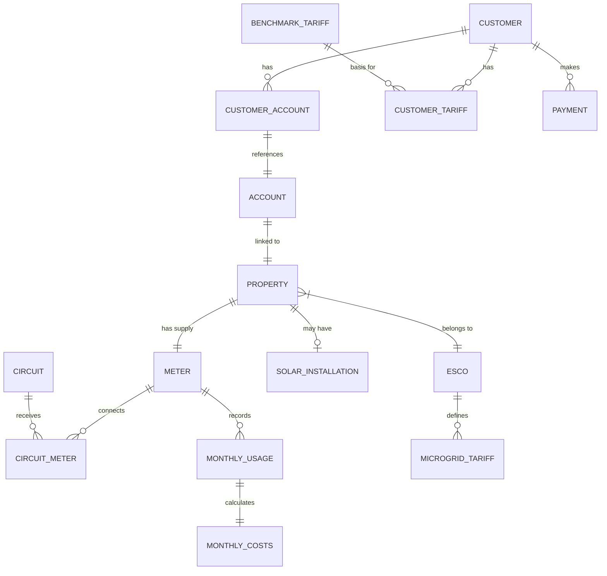

# Domain Model

The Flows platform is organized around several core business domains that work together to provide comprehensive energy management.

## Entity Relationship Overview



## Core Domains

### 1. Customer Domain

Manages customer profiles, accounts, and relationships.

**Key Entities:**
- `customers` - Customer master records
- `customer_accounts` - Links customers to accounts
- `customer_tariffs` - Customer-specific pricing
- `customer_events` - Audit trail
- `customer_invites` - Onboarding process

[Learn more →](/docs/flows/domain-model/customers)

### 2. Property & Metering Domain

Physical locations and their associated meters.

**Key Entities:**
- `properties` - Physical locations
- `meters` - Meter configurations
- `circuits` - Electrical circuits
- `circuit_meter` - Circuit-meter relationships
- `solar_installation` - Solar generation

[Learn more →](/docs/flows/domain-model/properties)

### 3. Billing & Payments Domain

Handles billing calculations and payment processing.

**Key Entities:**
- `payments` - Payment transactions
- `monthly_usage` - Monthly consumption
- `monthly_costs` - Cost calculations
- `monthly_solar_credits` - Solar generation credits

[Learn more →](/docs/flows/domain-model/billing)

### 4. Tariff Management Domain

Flexible tariff structures and pricing rules.

**Key Entities:**
- `benchmark_tariffs` - Reference pricing
- `microgrid_tariffs` - Community pricing
- `customer_tariffs` - Customer-specific rates
- `solar_credit_tariffs` - Solar credit rates

[Learn more →](/docs/flows/domain-model/tariffs)

### 5. Energy Community Domain

Multi-tenant support for energy communities.

**Key Entities:**
- `escos` - Energy Service Companies
- `sites` - Physical site groupings
- `contract_terms` - Legal agreements
- `contract_terms_esco` - ESCO-specific terms

[Learn more →](/docs/flows/domain-model/escos)

## Key Relationships

### Customer to Property Flow
```
Customer → Customer_Account → Account → Property → Meter
```

### Billing Calculation Flow
```
Meter → Monthly_Usage → Monthly_Costs ← Customer_Tariff
```

### Tariff Hierarchy
```
Benchmark_Tariff → Microgrid_Tariff → Customer_Tariff
```

## Data Integrity

### Constraints

- **Foreign Keys** - Enforced referential integrity
- **Unique Indexes** - Prevent duplicate records
- **Check Constraints** - Validate data values
- **NOT NULL** - Required field enforcement

### Audit Trail

- **Timestamps** - created_at, updated_at on all tables
- **Event Tables** - customer_events, account_events
- **Audit Logs** - account_audit_logs for changes
- **User Tracking** - Track who made changes

## Common Patterns

### Soft Deletes
Most entities use status fields rather than hard deletes:
- Customers: `status` (active, inactive, suspended)
- Accounts: `status` (active, closed)
- Meters: `mode` (active, passive, decommissioned)

### Temporal Data
Time-based data with period_start dates:
- Tariffs effective from specific dates
- Monthly aggregations for billing
- Historical tracking of changes

### Multi-tenancy
ESCO-based segregation of data:
- Properties belong to ESCOs
- Tariffs scoped by ESCO
- Billing runs per ESCO