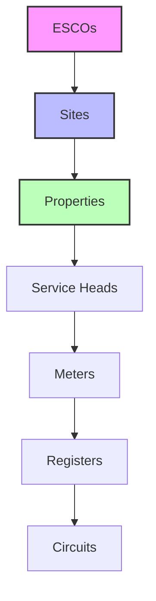
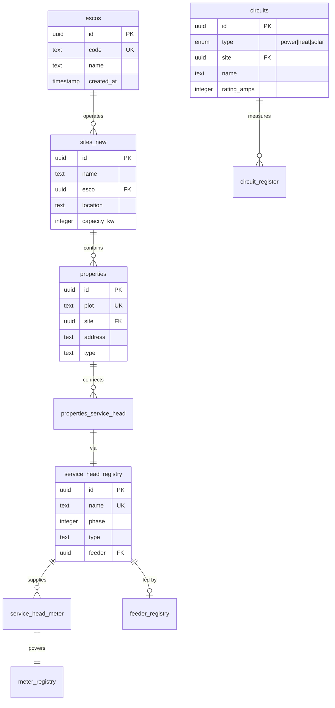

# Infrastructure Domain

The Infrastructure Domain models the physical and logical topology of the electrical network, from energy communities down to individual circuits.

## Entity Hierarchy



## Entity Relationship Diagram



## Core Entities

### escos (Energy Service Companies)

Top-level organizational entity managing energy communities.

**Key Fields:**
- `id` - UUID primary key
- `code` - Unique code (e.g., "WLCE", "HMCE")
- `name` - Full name (e.g., "Water Lilies Community Energy")
- `created_at` - Registration timestamp

**Usage:**
```sql
-- Get all sites for an ESCO
SELECT s.name, s.location, COUNT(p.id) as property_count
FROM flows.escos e
JOIN flows.sites_new s ON s.esco = e.id
LEFT JOIN flows.properties p ON p.site = s.id
WHERE e.code = 'WLCE'
GROUP BY s.name, s.location;
```

### sites_new

Physical locations containing multiple properties.

**Key Fields:**
- `id` - UUID primary key
- `name` - Site name
- `esco` - Parent ESCO UUID
- `location` - Geographic location
- `capacity_kw` - Total electrical capacity

**Examples:**
- Water Lilies Bristol (33 homes)
- Hazelmead Bridport (54 homes)
- Trent Basin Nottingham

### properties

Individual units within a site (houses, flats, commercial units).

**Key Fields:**
- `id` - UUID primary key
- `plot` - Unique plot/unit number
- `site` - Parent site UUID
- `address` - Full postal address
- `type` - Property type (residential, commercial)
- `created_at` - Creation timestamp

**Usage:**
```sql
-- Get property with meter details
SELECT 
    p.plot,
    p.address,
    mr.serial as meter_serial,
    ms.balance
FROM flows.properties p
JOIN flows.properties_service_head psh ON psh.property = p.id
JOIN flows.service_head_meter shm ON shm.service_head = psh.service_head
JOIN flows.meter_registry mr ON mr.id = shm.meter
JOIN flows.meter_shadows ms ON ms.id = mr.id
WHERE p.plot = 'WL-01';
```

### service_head_registry

Electrical connection points (cutouts) that connect properties to the network.

**Key Fields:**
- `id` - UUID primary key
- `name` - Unique identifier
- `phase` - Phase number (1, 2, or 3)
- `type` - `customer_owned` or `network_owned`
- `feeder` - Parent feeder UUID
- `created_at` - Installation date

**Relationship Rules:**
- One service head can supply multiple properties (shared supply)
- One property can have multiple service heads (multiple supplies)
- Service heads connect to meters via service_head_meter

### service_head_meter

Junction table linking service heads to meters.

**Key Fields:**
- `service_head` - Service head UUID
- `meter` - Meter UUID
- `created_at` - Connection date

### feeder_registry

Electrical feeders supplying service heads.

**Key Fields:**
- `id` - UUID primary key
- `name` - Feeder identifier
- `substation` - Parent substation name
- `rating_amps` - Current rating

### circuits

Logical grouping of electrical loads by type.

**Key Fields:**
- `id` - UUID primary key
- `type` - Circuit type enum:
  - `power` - Standard electrical loads
  - `heat` - Heat pumps and heating
  - `solar` - Solar generation
- `site` - Parent site UUID
- `name` - Circuit description
- `rating_amps` - Circuit breaker rating

**Usage:**
```sql
-- Get circuit consumption by type for a site
SELECT 
    c.type,
    c.name,
    SUM(ci.total_import_kwh) as daily_kwh
FROM flows.circuits c
LEFT JOIN flows.circuit_interval_daily ci ON ci.circuit_id = c.id
WHERE c.site = '{{site_id}}'
  AND ci.day = CURRENT_DATE - 1
GROUP BY c.type, c.name
ORDER BY c.type, daily_kwh DESC;
```

### circuit_register

Maps registers to circuits for consumption aggregation.

**Key Fields:**
- `circuit` - Circuit UUID
- `register` - Register UUID

## Topology Examples

### Simple Property Setup
```
ESCO (WLCE)
└── Site (Water Lilies)
    └── Property (WL-01)
        └── Service Head (SH-WL-01)
            └── Meter (EML2137580826)
                ├── Register A (day rate) → Power Circuit
                └── Register B (night rate) → Heat Circuit
```

### Shared Service Head
```
Service Head (SH-SHARED-01)
├── Property (WL-01)
├── Property (WL-02)
└── Meter (EML2137580833)
    └── Register (SINGLE) → Power Circuit
```

### Multiple Meters per Property
```
Property (WL-10)
├── Service Head 1 (SH-WL-10-1)
│   └── Supply Meter (EML2137580826)
│       └── Register → Power Circuit
└── Service Head 2 (SH-WL-10-2)
    └── Solar Meter (EML2137580827)
        └── Register → Solar Circuit
```

## Common Queries

### 1. Full Property Hierarchy
```sql
WITH property_hierarchy AS (
    SELECT 
        e.name as esco_name,
        s.name as site_name,
        p.plot,
        p.address,
        sh.name as service_head,
        mr.serial as meter_serial,
        mr.name as meter_name
    FROM flows.escos e
    JOIN flows.sites_new s ON s.esco = e.id
    JOIN flows.properties p ON p.site = s.id
    LEFT JOIN flows.properties_service_head psh ON psh.property = p.id
    LEFT JOIN flows.service_head_registry sh ON sh.id = psh.service_head
    LEFT JOIN flows.service_head_meter shm ON shm.service_head = sh.id
    LEFT JOIN flows.meter_registry mr ON mr.id = shm.meter
)
SELECT * FROM property_hierarchy
WHERE esco_name = 'Water Lilies Community Energy'
ORDER BY site_name, plot;
```

### 2. Site Infrastructure Summary
```sql
SELECT 
    s.name as site,
    COUNT(DISTINCT p.id) as properties,
    COUNT(DISTINCT sh.id) as service_heads,
    COUNT(DISTINCT m.id) as meters,
    COUNT(DISTINCT CASE WHEN c.type = 'power' THEN c.id END) as power_circuits,
    COUNT(DISTINCT CASE WHEN c.type = 'heat' THEN c.id END) as heat_circuits,
    COUNT(DISTINCT CASE WHEN c.type = 'solar' THEN c.id END) as solar_circuits
FROM flows.sites_new s
LEFT JOIN flows.properties p ON p.site = s.id
LEFT JOIN flows.properties_service_head psh ON psh.property = p.id
LEFT JOIN flows.service_head_registry sh ON sh.id = psh.service_head
LEFT JOIN flows.service_head_meter shm ON shm.service_head = sh.id
LEFT JOIN flows.meter_registry m ON m.id = shm.meter
LEFT JOIN flows.circuits c ON c.site = s.id
GROUP BY s.name;
```

### 3. Meters Without Properties
```sql
-- Find orphaned meters
SELECT 
    mr.serial,
    mr.name,
    e.name as esco
FROM flows.meter_registry mr
JOIN flows.escos e ON mr.esco = e.id
LEFT JOIN flows.service_head_meter shm ON shm.meter = mr.id
LEFT JOIN flows.properties_service_head psh ON psh.service_head = shm.service_head
WHERE psh.property IS NULL
  AND mr.mode = 'active';
```

### 4. Circuit Load Analysis
```sql
-- Peak load by circuit type
WITH circuit_peaks AS (
    SELECT 
        c.type,
        c.name,
        MAX(ci.total_import_kwh * 2) as peak_kw  -- Convert half-hourly to kW
    FROM flows.circuits c
    JOIN flows.circuit_interval_hh ci ON ci.circuit_id = c.id
    WHERE ci.timestamp >= NOW() - INTERVAL '7 days'
    GROUP BY c.type, c.name
)
SELECT 
    type,
    COUNT(*) as circuit_count,
    AVG(peak_kw) as avg_peak_kw,
    MAX(peak_kw) as max_peak_kw,
    SUM(peak_kw) as total_peak_kw
FROM circuit_peaks
GROUP BY type;
```

## Design Patterns

### Flexible Topology
- Many-to-many relationships allow complex real-world scenarios
- Service heads decouple meters from properties
- Circuits provide logical grouping independent of physical topology

### Hierarchical Organization
- Clear ownership chain: ESCO → Site → Property
- Electrical topology: Feeder → Service Head → Meter
- Consumption aggregation: Register → Circuit → Site

### Future-Proofing
- UUIDs allow distributed ID generation
- Junction tables enable relationship changes
- Type enums support new circuit/property types

## Best Practices

1. **Always maintain topology integrity** - Ensure meters are properly linked through service heads
2. **Use circuits for aggregation** - Don't aggregate registers directly
3. **Track installation dates** - Important for commissioning and warranty
4. **Validate phase assignments** - Critical for load balancing
5. **Document shared supplies** - Important for billing allocation

## Integration Points

### With Meter Domain
- meter_registry links via service_head_meter
- ESCO ownership tracked on meters

### With Data Collection
- Circuits aggregate register data
- Site-level consumption rolls up from circuits

### With Billing
- Property ownership determines billing responsibility
- Shared supplies require allocation rules