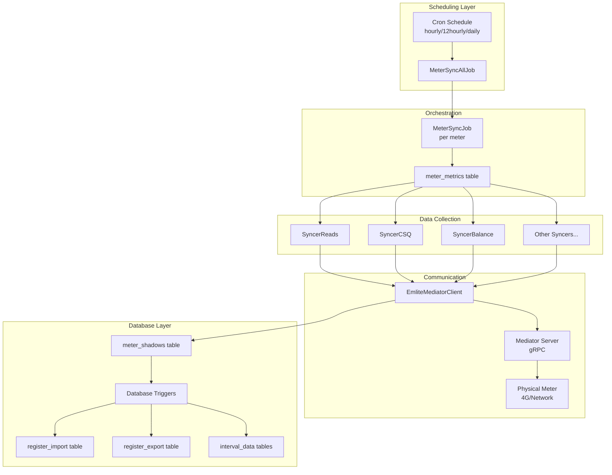

# How Meter Reads Get into the Flows Database

This guide explains the complete data flow of how meter readings are collected from physical meters and stored in the Flows database.

## Overview

Meter data collection in Flows is an automated process that runs on scheduled intervals. The system communicates with Emlite prepayment meters through mediator servers, collects various meter metrics, and stores them in a TimescaleDB database with automatic data propagation through database triggers.

## Architecture



## Detailed Process Flow

### 1. Scheduled Job Initiation

The process begins with scheduled jobs that run at different frequencies:

```python
# meter_sync_all.py
class MeterSyncAllJob:
    def run(self):
        # Query all active meters for an ESCO
        registry_result = (
            self.supabase.table("meter_registry")
            .select("id,ip_address,serial,hardware")
            .eq("esco", esco_id)
            .eq("mode", "active")  # Only sync active meters
            .execute()
        )
        
        # Spawn parallel jobs for each meter
        with concurrent.futures.ThreadPoolExecutor(max_workers=15) as executor:
            futures = [
                executor.submit(self.run_job, meter["id"], meter["serial"])
                for meter in meters
            ]
```

**Key Points:**
- Runs on schedule: hourly, 12-hourly, or daily
- Processes only active meters (not passive/virtual meters)
- Parallel execution with up to 15 concurrent meter syncs
- Filters by ESCO (Energy Service Company)

### 2. Per-Meter Synchronization

Each meter gets its own sync job that determines which metrics to collect:

```python
# meter_sync.py
class MeterSyncJob:
    def sync(self):
        # Get enabled metrics for this frequency
        query_result = (
            self.supabase.table("meter_metrics")
            .select("*")
            .eq("enabled", True)
            .eq("run_frequency", self.run_frequency)
            .execute()
        )
        
        # Dynamically load and run appropriate syncer
        for metric in query_result.data:
            syncer_class = find_syncer_class(metric["name"])
            syncer = syncer_class(self.supabase, self.emlite_client, self.meter_id)
            syncer.sync()
```

### 3. Data Collection via Syncers

Different syncer classes collect specific meter data. The main one for register reads is `SyncerReads`:

```python
# syncer_reads.py
class SyncerReads(SyncerBase):
    def fetch_metrics(self):
        # Read Element A (peak/day rate)
        element_a_read = self.emlite_client.read_element_a()
        # Read Element B (off-peak/night rate)
        element_b_read = self.emlite_client.read_element_b()
        
        metrics = {
            "import_a": element_a_read["import_active"],
            "import_b": element_b_read["import_active"],
            "export_a": element_a_read["export_active"],
            "export_b": element_b_read["export_active"],
        }
        
        return UpdatesTuple(metrics, None)
```

**Available Syncers:**
- `SyncerReads` - Import/export register readings
- `SyncerPrepayBalance` - Current prepayment balance
- `SyncerCSQ` - Signal quality metrics
- `SyncerTariffsActive` - Currently active tariff
- `SyncerTariffsFuture` - Scheduled future tariff
- `SyncerEventLog` - Meter event history
- `SyncerHardware` - Hardware version info
- `SyncerFirmwareVersion` - Firmware details
- `SyncerClockDiff` - Time synchronization status
- `SyncerVoltage` - Voltage readings

### 4. Communication with Meters

The `EmliteMediatorClient` handles the actual communication:

```python
# Communication flow
emlite_client = EmliteMediatorClient(
    mediator_address="mediator.address:50051",
    meter_id=meter_id
)

# Uses EMOP (Emlite Meter Operating Protocol) via gRPC
# Mediator server handles the 4G/network connection to meter
response = emlite_client.read_element_a()
```

### 5. Database Update - meter_shadows Table

The syncer base class updates the `meter_shadows` table:

```python
# syncer_base.py
def _update_shadow(self, update_props):
    # Update meter_shadows with new readings
    update_meter_shadows_when_healthy(
        self.supabase, 
        self.meter_id, 
        update_props  # Contains import_a, import_b, export_a, export_b
    )

# util.py
def update_meter_shadows_when_healthy(supabase, meter_id, update_properties):
    return (
        supabase.table("meter_shadows")
        .update({
            **update_properties,
            "health": "healthy",
            "health_details": "",
        })
        .eq("id", meter_id)
        .execute()
    )
```

### 6. Automatic Data Propagation via Triggers

PostgreSQL triggers automatically populate the historical register tables when `meter_shadows` is updated:

```sql
-- Trigger for import readings on Element A
CREATE TRIGGER meter_shadows_import_a_update 
AFTER UPDATE OF import_a ON flows.meter_shadows 
FOR EACH ROW 
EXECUTE FUNCTION flows.register_import_a_insert();

-- Function that inserts into register_import
CREATE FUNCTION flows.register_import_a_insert() RETURNS trigger AS $$
DECLARE
    _register_id uuid;
BEGIN
    -- Find the register ID for this meter's Element A
    SELECT mr.register_id INTO _register_id
    FROM flows.meter_registers mr
    WHERE mr.meter_id = new.id AND mr.element = 'A';

    -- Insert the new reading with timestamp
    INSERT INTO flows.register_import(register_id, read, timestamp)
    VALUES (_register_id, new.import_a, new.updated_at);

    RETURN new;
END;
$$;
```

**Similar triggers exist for:**
- `meter_shadows_import_b_update` → `register_import` (Element B)
- `meter_shadows_export_a_update` → `register_export` (Element A)
- `meter_shadows_export_b_update` → `register_export` (Element B)

## Data Storage Structure

### meter_shadows (Current State)
Contains the latest readings for each meter:
- `import_a` - Current import reading for Element A
- `import_b` - Current import reading for Element B
- `export_a` - Current export reading for Element A
- `export_b` - Current export reading for Element B
- `balance` - Current prepayment balance
- `health` - Meter connectivity status
- `updated_at` - Last update timestamp

### register_import/export (Historical Data)
Time-series tables storing all historical readings:
- `register_id` - Links to meter_registers
- `read` - The actual meter reading value
- `timestamp` - When the reading was taken

### register_interval_hh (Half-Hourly Data)
Stores 30-minute interval consumption data:
- `import_interval` - Consumption in the interval
- `export_interval` - Generation in the interval
- `timestamp` - Start of the interval

## Configuration

### Meter Metrics Table

The `meter_metrics` table controls what data is collected:

```sql
-- Example configuration
INSERT INTO meter_metrics (name, enabled, run_frequency) VALUES
('SyncerReads', true, 'hourly'),
('SyncerPrepayBalance', true, 'hourly'),
('SyncerCSQ', true, '12hourly'),
('SyncerEventLog', true, 'daily');
```

### Environment Variables

Required environment configuration:
```bash
SUPABASE_URL=https://your-instance.supabase.co
SUPABASE_ANON_KEY=your-anon-key
FLOWS_ROLE_KEY=your-role-key
MAX_PARALLEL_JOBS=15  # Maximum concurrent meter syncs
```

## Error Handling

### Meter Communication Failures

When a meter is unreachable:

```python
def handle_meter_unhealthy_status(supabase, logger, meter_id, exception):
    # Mark meter as unhealthy in shadows table
    supabase.table("meter_shadows").update({
        "health": "unhealthy",
        "health_details": exception.message,
        "csq": None
    }).eq("id", meter_id).execute()
```

### Retry Logic

- Jobs continue even if individual meters fail
- Unhealthy meters are marked and skipped
- Next scheduled run will retry failed meters
- Parallel execution ensures one failure doesn't block others

## Performance Considerations

### Parallel Processing
- Up to 15 meters processed simultaneously
- Thread pool executor for efficient resource usage
- Each meter sync is independent

### Database Optimization
- Triggers handle data propagation efficiently
- TimescaleDB optimized for time-series data
- Hypertables for automatic partitioning
- Compression policies for historical data

### Network Efficiency
- Mediator servers maintain persistent connections
- gRPC for efficient binary protocol
- Batch reads where possible (Element A & B together)

## Monitoring and Debugging

### Check Sync Status
```sql
-- View recent sync activity
SELECT 
    ms.id,
    mr.serial,
    ms.health,
    ms.updated_at,
    ms.import_a,
    ms.import_b
FROM meter_shadows ms
JOIN meter_registry mr ON ms.id = mr.id
WHERE ms.updated_at > NOW() - INTERVAL '1 hour'
ORDER BY ms.updated_at DESC;
```

### Verify Data Collection
```sql
-- Check if readings are being collected
SELECT 
    DATE_TRUNC('hour', timestamp) as hour,
    COUNT(*) as reading_count
FROM register_import
WHERE timestamp > NOW() - INTERVAL '24 hours'
GROUP BY hour
ORDER BY hour DESC;
```

### Debug Failed Syncs
```sql
-- Find unhealthy meters
SELECT 
    mr.serial,
    ms.health,
    ms.health_details,
    ms.updated_at
FROM meter_shadows ms
JOIN meter_registry mr ON ms.id = mr.id
WHERE ms.health = 'unhealthy'
ORDER BY ms.updated_at DESC;
```

## Best Practices

1. **Schedule Appropriately**
   - Use hourly for critical metrics (balance, readings)
   - Use daily for stable data (hardware, firmware)
   - Consider network load and meter battery life

2. **Monitor Health Status**
   - Set up alerts for unhealthy meters
   - Track sync success rates
   - Monitor data freshness

3. **Handle Time Zones**
   - All timestamps in UTC
   - Convert for display only
   - Consider daylight saving transitions

4. **Data Validation**
   - Check for reading reversals
   - Validate against expected consumption patterns
   - Flag anomalies for investigation

## Summary

The Flows meter data collection system is a robust, automated pipeline that:
1. Runs scheduled jobs to sync meter data
2. Communicates with meters via mediator servers
3. Collects various metrics through specialized syncers
4. Updates the meter_shadows table with current state
5. Automatically propagates historical data via database triggers
6. Handles errors gracefully with health status tracking

This architecture ensures reliable, scalable collection of meter data while maintaining a complete audit trail of all readings.