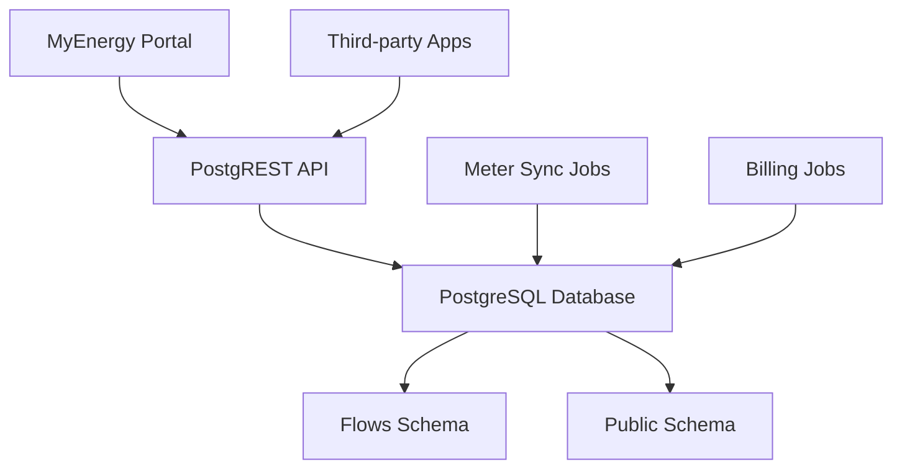

# Flows Platform

Flows is Simtricity's core billing and metering platform, built on PostgreSQL with PostgREST API.

## What is Flows?

Flows manages the entire lifecycle of energy billing, from meter readings to customer invoicing. It handles:

- **Customer Management** - Customer profiles, accounts, and relationships
- **Meter Management** - Meter configuration, readings, and synchronization
- **Tariff Management** - Flexible tariff structures and automated updates
- **Billing Engine** - Monthly billing runs and payment processing
- **Energy Communities** - Support for ESCOs (Energy Service Companies)

## Architecture Overview

## Key Features

- **Multi-tenant** - Support for multiple energy communities
- **Real-time Sync** - Automated meter synchronization
- **Flexible Tariffs** - Time-of-use, tiered, and custom tariff structures
- **Audit Trail** - Complete audit logging of all changes
- **RESTful API** - Standard PostgREST interface

## Domain Model

The Flows platform is organized around these core domains:

- [Customers](/docs/flows/domain-model/customers) - Customer and account management
- [Properties](/docs/flows/domain-model/properties) - Physical locations and meters
- [Tariffs](/docs/flows/domain-model/tariffs) - Pricing and rate structures
- [Billing](/docs/flows/domain-model/billing) - Usage calculation and invoicing
- [Payments](/docs/flows/domain-model/payments) - Payment processing and tracking

## Getting Started

1. [Installation Guide](/docs/getting-started/flows-installation)
2. [Database Schema](/docs/flows/database/schema)
3. [API Reference](/docs/api-reference/flows/)

## Learn More

- [Architecture Details](/docs/flows/architecture)
- [Database Schema](/docs/flows/database/)
- [API Documentation](/docs/api-reference/flows/)