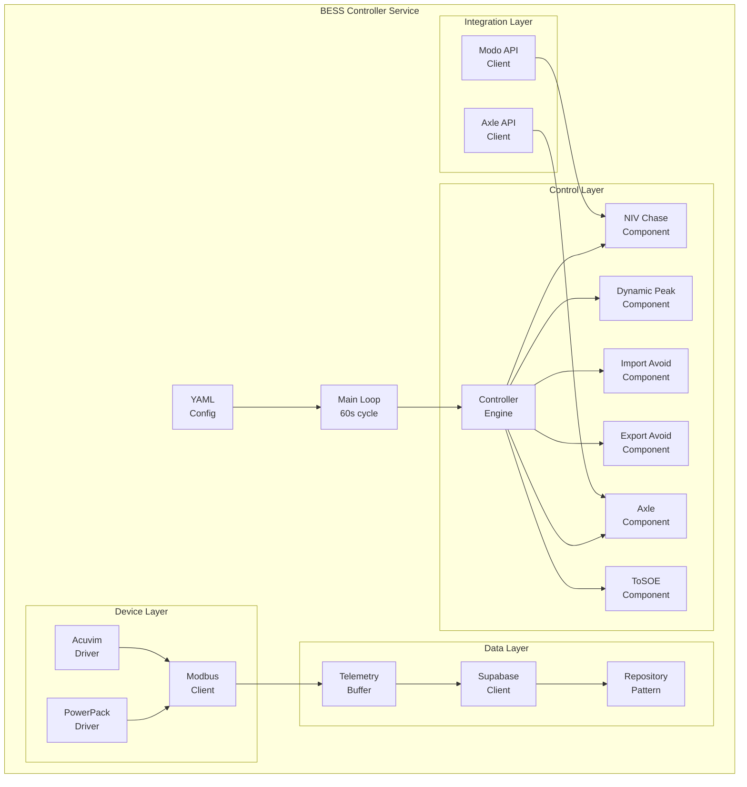
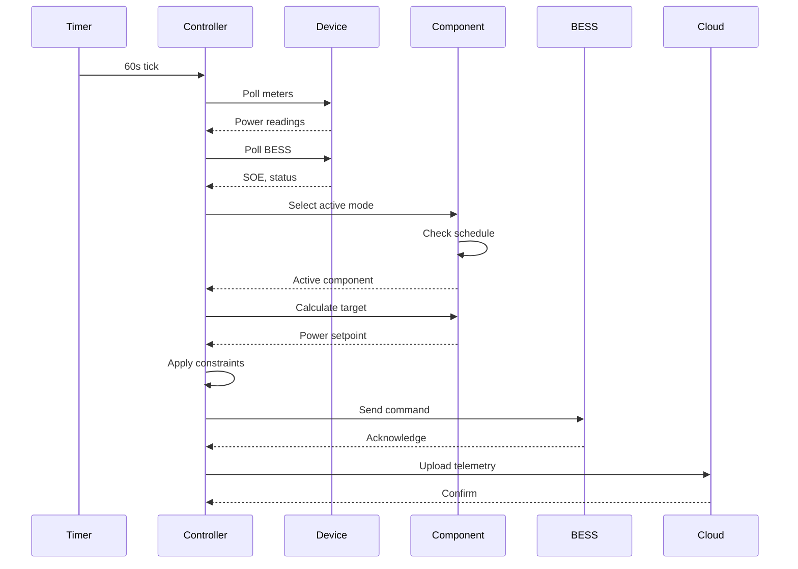

# BESS Controller Architecture

The BESS Controller is a Go service that runs on RevPi industrial controllers at microgrid sites. It provides real-time battery control, device communication, and market integration capabilities.

## System Architecture



## Core Components

### Main Controller (`controller.go`)

The central orchestration engine that:
- Manages control loop timing (60-second cycles)
- Prioritizes control modes based on configuration
- Applies constraints (SOE limits, power limits)
- Handles mode transitions and scheduling

```go
type Controller struct {
    components       []ControlComponent
    activeComponent  ControlComponent
    constraints      ActiveConstraints
    telemetry       TelemetryClient
    schedule        Schedule
}
```

### Control Components

Each control mode implements the `ControlComponent` interface:

```go
type ControlComponent interface {
    Name() string
    Priority() int
    IsActive(time.Time) bool
    CalculateTarget(state SystemState) (float64, error)
    UpdateState(readings TelemetryData)
}
```

**Available Components:**
- **NIV Chase** (`comp_niv_chase.go`): Follow grid imbalance signals
- **Dynamic Peak** (`comp_dynamic_peak.go`): Reduce peak demand
- **Import Avoidance** (`comp_import_avoidance.go`): Prevent grid import
- **Export Avoidance** (`comp_export_avoidance.go`): Prevent grid export
- **Axle Integration** (`comp_axle.go`): Execute market dispatches
- **ToSOE** (`comp_to_soe.go`): Target specific SOE levels

### Device Drivers

#### PowerPack Driver (`powerpack/`)
Communicates with battery systems:
```go
type PowerPackClient struct {
    modbusClient *modbus.Client
    address      uint8
    registers    map[string]uint16
}

// Key registers
const (
    RegTargetPower = 2008  // Write target power
    RegSOE        = 2026  // Read state of energy
    RegStatus     = 2000  // Read system status
)
```

#### Acuvim Driver (`acuvim2/`)
Reads power meter data:
```go
type AcuvimClient struct {
    modbusClient *modbus.Client
    address      uint8
}

// Key measurements
func (c *AcuvimClient) ReadPower() (float64, error)
func (c *AcuvimClient) ReadEnergy() (float64, error)
func (c *AcuvimClient) ReadVoltage() (float64, error)
```

### Data Platform Integration

#### Supabase Client (`supabase/`)
Handles cloud data upload:
```go
type SupabaseClient struct {
    url        string
    anonKey    string
    userKey    string
    httpClient *http.Client
}

func (c *SupabaseClient) UploadReadings(readings []Reading) error {
    // Batch upload with retry logic
    // Handles 409 conflicts for duplicates
}
```

## Control Modes

### NIV Chase Mode

Follows Net Imbalance Volume to provide grid balancing:

```go
type NivChaseComponent struct {
    modoClient    *modo.Client
    targetFactor  float64  // Scaling factor (0.0-1.0)
    maxPower      float64  // Power limit (kW)
}

func (n *NivChaseComponent) CalculateTarget(state SystemState) float64 {
    niv := n.modoClient.GetLatestNIV()
    target := niv * n.targetFactor * 1000  // MW to kW
    return clamp(target, -n.maxPower, n.maxPower)
}
```

**Configuration:**
```yaml
components:
  - type: niv_chase
    priority: 1
    schedule:
      - start: "00:00"
        end: "23:59"
    config:
      target_factor: 0.8
      max_power: 100
```

### Dynamic Peak Avoidance

Reduces site peak demand:

```go
type DynamicPeakComponent struct {
    threshold     float64  // Trigger level (kW)
    target        float64  // Target reduction (kW)
    historicalPeak float64  // Current period peak
}

func (d *DynamicPeakComponent) CalculateTarget(state SystemState) float64 {
    siteDemand := state.MeterPower
    if siteDemand > d.threshold {
        // Discharge to reduce peak
        return -(siteDemand - d.target)
    }
    return 0
}
```

### Import/Export Avoidance

Prevents power flow in specified direction:

```go
type ImportAvoidanceComponent struct {
    buffer float64  // Safety margin (kW)
}

func (i *ImportAvoidanceComponent) CalculateTarget(state SystemState) float64 {
    gridPower := state.MeterPower
    if gridPower > i.buffer {
        // Discharge to offset import
        return -gridPower + i.buffer
    }
    return 0
}
```

## Configuration Structure

### YAML Configuration

```yaml
# Site configuration example
site:
  name: "WLCE"
  location: "Water Lilies"

devices:
  bess:
    - id: "123e4567-e89b-12d3-a456-426614174000"
      name: "PowerPack-01"
      modbus:
        address: 1
        host: "192.168.1.100"
        port: 502
  
  meters:
    - id: "987e6543-e21b-12d3-a456-426614174000"
      name: "Grid-Meter"
      modbus:
        address: 2
        host: "192.168.1.101"
        port: 502

controller:
  poll_interval: 60  # seconds
  
  constraints:
    min_soe: 10  # %
    max_soe: 90  # %
    max_power: 100  # kW
    min_power: -100  # kW
  
  components:
    - type: "niv_chase"
      priority: 1
      enabled: true
      schedule:
        - days: ["monday", "tuesday", "wednesday", "thursday", "friday"]
          start: "16:00"
          end: "19:00"
      config:
        modo_api_key: "${MODO_API_KEY}"
        target_factor: 0.8
    
    - type: "dynamic_peak"
      priority: 2
      enabled: true
      schedule:
        - days: ["all"]
          start: "00:00"
          end: "23:59"
      config:
        threshold: 150
        target: 120

data_platform:
  supabase:
    url: "${SUPABASE_URL}"
    anon_key: "${SUPABASE_ANON_KEY}"
    service_key: "${SUPABASE_SERVICE_KEY}"
  
  upload_interval: 60  # seconds
  batch_size: 100
```

### Environment Variables

Sensitive configuration via environment:

```bash
# /home/pi/bess_controller/envvars
export SUPABASE_URL="https://your-project.supabase.co"
export SUPABASE_ANON_KEY="your-anon-key-here"
export SUPABASE_SERVICE_KEY="your-service-key-here"
export MODO_API_KEY="your-modo-api-key"
export AXLE_API_KEY="your-axle-api-key"
```

## Control Flow

### Main Loop Sequence



### Priority Resolution

Components are evaluated in priority order:

1. Check if component is scheduled active
2. Evaluate component conditions
3. Calculate target power
4. Apply safety constraints
5. Send command to BESS

## Testing

### Unit Tests

```bash
cd bess_controller/src
go test ./controller -v
```

### Integration Tests

```bash
# Test with mock Modbus server
go test ./controller -tags=integration
```

### Debug Mode

```yaml
# debug.yaml
debug:
  enabled: true
  mock_devices: true
  log_level: "debug"
  dry_run: true
```

## Performance Metrics

- **Poll Cycle**: 60 seconds typical
- **Modbus Latency**: &lt;100ms per device
- **Decision Time**: &lt;10ms
- **Upload Latency**: &lt;500ms
- **Memory Usage**: ~50MB
- **CPU Usage**: &lt;5% on RevPi

## Error Handling

- Automatic reconnection for Modbus failures
- Telemetry buffering during network outages
- Graceful degradation to safe mode
- Comprehensive logging via systemd journal

## Next Steps

- [Control Modes](./modes/) - Detailed mode documentation
- [Deployment Guide](../deployment/) - Install on RevPi
- [API Reference](../api/) - Integration points