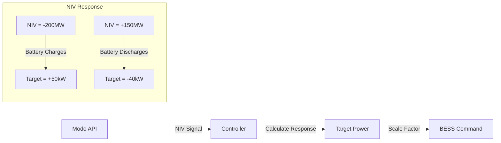

# Control Modes

Flux implements multiple control strategies that can be scheduled and prioritized based on market conditions and site requirements.

## NIV Chase Mode

### Overview

Net Imbalance Volume (NIV) Chase mode helps balance the electricity grid by responding to system imbalances. When the grid has excess generation (negative NIV), the battery charges; when there's excess demand (positive NIV), it discharges.

### How It Works



### Configuration

```yaml
components:
  - type: niv_chase
    enabled: true
    priority: 1
    schedule:
      - days: ["weekday"]
        start: "16:00"
        end: "19:00"
    config:
      modo_api_key: "${MODO_API_KEY}"
      target_factor: 0.0003  # Response per MW of NIV
      max_power: 50.0        # kW limit
      deadband: 20.0         # MW - ignore small NIV
      update_interval: 60s
```

### Implementation

```go
func (n *NivChaseComponent) CalculateTarget(state SystemState) (float64, error) {
    // Get latest NIV estimate
    niv, err := n.modoClient.GetLatestNIV()
    if err != nil {
        return 0, fmt.Errorf("failed to get NIV: %w", err)
    }
    
    // Apply deadband
    if math.Abs(niv) < n.config.Deadband {
        return 0, nil
    }
    
    // Calculate proportional response
    // Negative NIV = grid has excess = battery should charge (positive power)
    // Positive NIV = grid needs power = battery should discharge (negative power)
    target := -niv * n.config.TargetFactor * 1000 // MW to kW
    
    // Apply power limits
    target = clamp(target, -n.config.MaxPower, n.config.MaxPower)
    
    // Check SOE constraints
    if state.SOE < 20 && target > 0 {
        target = 0 // Don't discharge when low
    }
    if state.SOE > 80 && target < 0 {
        target = 0 // Don't charge when full
    }
    
    return target, nil
}
```

### Market Opportunity

- **Revenue**: £30-80/MWh for balancing services
- **Best Times**: Peak periods (16:00-19:00)
- **Risk**: Low - following market signals

## Dynamic Peak Avoidance

### Overview

Reduces site peak demand to minimize network charges and capacity costs. The controller monitors site consumption and discharges the battery when approaching threshold levels.

### Peak Detection Algorithm

```go
type DynamicPeakComponent struct {
    threshold        float64   // kW trigger level
    target          float64   // kW target after reduction
    monthlyPeak     float64   // Current month's peak
    rollingAverage  float64   // 5-minute average
    peakTimes       []string  // Historical peak periods
}

func (d *DynamicPeakComponent) CalculateTarget(state SystemState) (float64, error) {
    // Update rolling average
    d.updateRollingAverage(state.MeterPower)
    
    // Predict if we're approaching peak
    predicted := d.predictPeak()
    
    if predicted > d.threshold {
        // Calculate reduction needed
        reduction := predicted - d.target
        
        // Ensure battery can sustain discharge
        sustainableTime := (state.SOE - 10) * d.batteryCapacity / reduction
        if sustainableTime < 30 { // minutes
            reduction = reduction * (sustainableTime / 30)
        }
        
        return -reduction, nil // Negative = discharge
    }
    
    // Charge during off-peak if SOE low
    if state.MeterPower < d.threshold * 0.5 && state.SOE < 50 {
        chargeRate := min(d.maxCharge, d.threshold - state.MeterPower)
        return chargeRate, nil
    }
    
    return 0, nil
}
```

### Configuration

```yaml
components:
  - type: dynamic_peak
    enabled: true
    priority: 2
    schedule:
      - days: ["all"]
        start: "00:00"
        end: "23:59"
    config:
      threshold: 150.0        # kW - start reducing above this
      target: 120.0          # kW - reduce to this level
      prediction_window: 5m   # Look-ahead time
      min_soe_discharge: 20.0 # Don't discharge below
      charge_threshold: 0.5   # Charge when below 50% of threshold
```

### Peak Prediction

```go
func (d *DynamicPeakComponent) predictPeak() float64 {
    now := time.Now()
    
    // Check if in historical peak window
    hour := now.Hour()
    if hour >= 16 && hour <= 19 {
        // Likely peak period
        return d.rollingAverage * 1.1 // Add 10% margin
    }
    
    // Use machine learning model for better prediction
    features := []float64{
        float64(hour),
        float64(now.Weekday()),
        d.rollingAverage,
        d.monthlyPeak,
    }
    
    return d.model.Predict(features)
}
```

## Import/Export Avoidance

### Import Avoidance

Prevents or minimizes grid electricity import by discharging battery to meet local demand.

```go
func (i *ImportAvoidanceComponent) CalculateTarget(state SystemState) (float64, error) {
    gridPower := state.MeterPower
    
    // Positive grid power = importing
    if gridPower > i.config.Buffer {
        // Discharge to offset import
        discharge := gridPower - i.config.Buffer
        
        // Check battery constraints
        maxDischarge := min(discharge, i.config.MaxPower)
        if state.SOE < i.config.MinSOE {
            maxDischarge = 0
        }
        
        return -maxDischarge, nil
    }
    
    return 0, nil
}
```

### Export Avoidance

Prevents electricity export to grid by charging battery with excess generation.

```go
func (e *ExportAvoidanceComponent) CalculateTarget(state SystemState) (float64, error) {
    gridPower := state.MeterPower
    
    // Negative grid power = exporting
    if gridPower < -e.config.Buffer {
        // Charge to absorb export
        charge := math.Abs(gridPower) - e.config.Buffer
        
        // Check battery constraints
        maxCharge := min(charge, e.config.MaxPower)
        if state.SOE > e.config.MaxSOE {
            maxCharge = 0
        }
        
        return maxCharge, nil
    }
    
    return 0, nil
}
```

### Configuration

```yaml
components:
  - type: import_avoidance
    enabled: true
    priority: 3
    config:
      buffer: 5.0         # kW - allow small import
      max_power: 100.0    # kW - max discharge rate
      min_soe: 15.0       # % - preserve minimum
      
  - type: export_avoidance
    enabled: true
    priority: 3
    config:
      buffer: 5.0         # kW - allow small export
      max_power: 100.0    # kW - max charge rate
      max_soe: 95.0       # % - preserve headroom
```

## Axle Integration Mode

### Overview

Executes dispatch instructions from Axle Energy's flexibility platform for grid services and market participation.

### Dispatch Handling

```go
type AxleComponent struct {
    client     *axle.Client
    dispatch   *axle.Dispatch
    lastUpdate time.Time
}

func (a *AxleComponent) CalculateTarget(state SystemState) (float64, error) {
    // Fetch latest dispatch
    if time.Since(a.lastUpdate) > 30*time.Second {
        dispatch, err := a.client.GetActiveDispatch()
        if err != nil {
            return 0, err
        }
        a.dispatch = dispatch
        a.lastUpdate = time.Now()
    }
    
    // No active dispatch
    if a.dispatch == nil || !a.dispatch.IsActive() {
        return 0, nil
    }
    
    // Execute dispatch
    target := a.dispatch.PowerSetpoint
    
    // Validate against constraints
    if target > 0 && state.SOE > 90 {
        // Can't charge, report limitation
        a.client.ReportLimitation(a.dispatch.ID, "SOE too high")
        target = 0
    }
    if target < 0 && state.SOE < 10 {
        // Can't discharge, report limitation
        a.client.ReportLimitation(a.dispatch.ID, "SOE too low")
        target = 0
    }
    
    return target, nil
}
```

### Dispatch Types

| Type | Description | Duration | Response Time |
|------|-------------|----------|---------------|
| FFR | Firm Frequency Response | 30 min | 1 second |
| DFS | Dynamic Frequency Support | Continuous | 1 second |
| BM | Balancing Mechanism | Variable | 5 minutes |
| Triad | Peak avoidance | 30 min | Scheduled |

## ToSOE Mode

### Overview

Targets a specific State of Energy (SOE) level by a certain time, useful for preparing for known events or market opportunities.

### Implementation

```go
type ToSOEComponent struct {
    targetSOE   float64
    targetTime  time.Time
    rampRate   float64
}

func (t *ToSOEComponent) CalculateTarget(state SystemState) (float64, error) {
    // Calculate time remaining
    timeRemaining := time.Until(t.targetTime).Hours()
    if timeRemaining <= 0 {
        return 0, nil // Target time passed
    }
    
    // Calculate energy needed
    currentEnergy := state.SOE * t.batteryCapacity / 100
    targetEnergy := t.targetSOE * t.batteryCapacity / 100
    energyDelta := targetEnergy - currentEnergy
    
    // Calculate required power
    requiredPower := energyDelta / timeRemaining
    
    // Apply ramp rate limits
    if math.Abs(requiredPower - state.CurrentPower) > t.rampRate {
        if requiredPower > state.CurrentPower {
            requiredPower = state.CurrentPower + t.rampRate
        } else {
            requiredPower = state.CurrentPower - t.rampRate
        }
    }
    
    // Apply power limits
    requiredPower = clamp(requiredPower, -t.maxPower, t.maxPower)
    
    return requiredPower, nil
}
```

### Use Cases

```yaml
# Prepare for evening peak
- type: to_soe
  schedule:
    - start: "14:00"
      end: "16:00"
  config:
    target_soe: 90.0
    ramp_rate: 5.0  # kW/min
    
# Discharge before cheap overnight rates
- type: to_soe
  schedule:
    - start: "22:00"
      end: "23:30"
  config:
    target_soe: 20.0
    ramp_rate: 3.0
```

## Mode Prioritization

### Priority Resolution

When multiple modes are active, the controller selects based on priority:

```go
func (c *Controller) selectActiveMode(time time.Time) ControlComponent {
    var activeComponents []ControlComponent
    
    // Find all scheduled active components
    for _, comp := range c.components {
        if comp.IsActive(time) {
            activeComponents = append(activeComponents, comp)
        }
    }
    
    // Sort by priority (lower number = higher priority)
    sort.Slice(activeComponents, func(i, j int) bool {
        return activeComponents[i].Priority() < activeComponents[j].Priority()
    })
    
    // Return highest priority
    if len(activeComponents) > 0 {
        return activeComponents[0]
    }
    
    return nil // No active mode
}
```

### Priority Guidelines

| Priority | Use Case | Example Modes |
|----------|----------|---------------|
| 0 | Safety/Emergency | Emergency Stop, Maintenance |
| 1 | Market Commitments | Axle Dispatch, FFR |
| 2 | Economic Optimization | NIV Chase, Energy Arbitrage |
| 3 | Site Benefits | Peak Avoidance, Self-Consumption |
| 4 | Grid Support | Import/Export Avoidance |
| 5 | Preparation | ToSOE, Preconditioning |

## Mode Transitions

### Smooth Transitions

```go
func (c *Controller) transitionMode(from, to ControlComponent) error {
    if from != nil {
        // Ramp down current mode
        currentPower := c.getCurrentPower()
        for currentPower > 1.0 {
            currentPower = currentPower * 0.9
            c.setPower(currentPower)
            time.Sleep(1 * time.Second)
        }
        
        // Log transition
        log.Printf("Transitioning from %s to %s", 
            from.Name(), to.Name())
    }
    
    // Activate new mode
    c.activeComponent = to
    
    return nil
}
```

## Next Steps

- [Controller Architecture](./) - System overview
- [Deployment Guide](../deployment/) - Configure modes
- [Operations Guide](../operations/) - Monitor mode performance