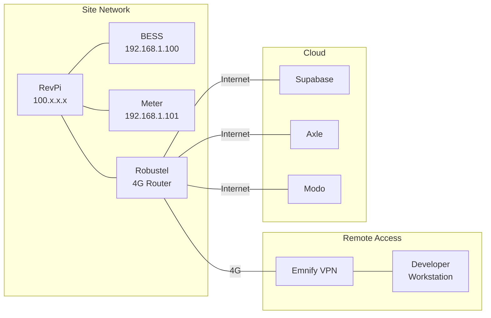

# Flux Deployment Guide

This guide covers deploying the BESS Controller service to RevPi industrial controllers at microgrid sites.

## Prerequisites

### Hardware Requirements
- **RevPi Connect+** or **RevPi Core** device
- Network connectivity (Ethernet/4G via Robustel)
- Modbus TCP access to BESS and meters
- Emnify VPN for remote access

### Software Requirements
- Raspbian-based RevPi OS
- Go 1.20+ (for local builds)
- systemd for service management
- SSH access via Emnify VPN

## Network Architecture



## Building the Controller

### Cross-Compilation for ARM

```bash
# Clone the repository
git clone https://github.com/cepro/simt-flux.git
cd simt-flux/bess_controller/src

# Build for 64-bit ARM (newer RevPi)
env GOARCH=arm64 GOOS=linux go build \
  -o ../bess_controller_rpi_64 main.go

# Build for 32-bit ARM (older RevPi)
env GOARCH=arm GOARM=5 GOOS=linux go build \
  -o ../bess_controller_rpi main.go

# Check binary
file ../bess_controller_rpi_64
```

### Local Testing

```bash
# Run with debug configuration
go run main.go -f ../docs/debug.yaml

# Test with mock devices
go run main.go -f ../docs/debug.yaml --mock-devices
```

## Site Configuration

### 1. Create Site Config File

```yaml
# site_configs/wlce_config.yaml
site:
  name: "WLCE"
  location: "Water Lilies Community Energy"
  timezone: "Europe/London"

devices:
  bess:
    - id: "11111111-1111-1111-1111-111111111111"
      name: "WLCE-BESS-01"
      type: "powerpack"
      modbus:
        host: "192.168.1.100"
        port: 502
        address: 1
        timeout: 5s
        
  meters:
    - id: "22222222-2222-2222-2222-222222222222"
      name: "WLCE-GRID-01"
      type: "acuvim2"
      modbus:
        host: "192.168.1.101"
        port: 502
        address: 2
        timeout: 5s

controller:
  poll_interval: 60s
  
  constraints:
    min_soe: 10.0
    max_soe: 90.0
    max_charge_power: 100.0
    max_discharge_power: 100.0
  
  components:
    - type: "niv_chase"
      enabled: true
      priority: 1
      schedule:
        - days: ["weekday"]
          start: "16:00"
          end: "19:00"
      config:
        modo_api_key: "${MODO_API_KEY}"
        target_factor: 0.8
        max_power: 50.0
    
    - type: "dynamic_peak"
      enabled: true
      priority: 2
      schedule:
        - days: ["all"]
          start: "00:00"
          end: "23:59"
      config:
        threshold: 150.0
        target: 120.0

data_platform:
  supabase:
    url: "${SUPABASE_URL}"
    anon_key: "${SUPABASE_ANON_KEY}"
    service_key: "${SUPABASE_SERVICE_KEY}"
  
  upload:
    interval: 60s
    batch_size: 100
    retry_count: 3

logging:
  level: "info"
  format: "json"
```

### 2. Create Environment File

```bash
# ~/bess_controller/envvars
export SUPABASE_URL="https://your-project.supabase.co"
export SUPABASE_ANON_KEY="your-anon-key-here"
export SUPABASE_SERVICE_KEY="your-service-key-here"
export MODO_API_KEY="your-modo-api-key"
export AXLE_API_KEY="your-axle-api-key"
```

## Deployment Process

### 1. Connect to RevPi

```bash
# Via Emnify VPN 
ssh -p <ssh-port> pi@<site-vpn-ip>

# Check system
uname -a
cat /etc/os-release
```

### 2. Create Directory Structure

```bash
# On RevPi
mkdir -p ~/bess_controller
cd ~/bess_controller

# Directory layout
# ~/bess_controller/
# ├── bess_controller         (executable)
# ├── config.yaml            (site config)
# ├── envvars                (secrets)
# └── logs/                  (optional)
```

### 3. Deploy Files

```bash
# From local machine
# Copy binary
scp -P <ssh-port> bess_controller_rpi_64 \
  pi@<site-vpn-ip>:~/bess_controller/bess_controller

# Copy configuration
scp -P <ssh-port> site_configs/wlce_config.yaml \
  pi@<site-vpn-ip>:~/bess_controller/config.yaml

# Make executable
ssh -p <ssh-port> pi@<site-vpn-ip> \
  "chmod +x ~/bess_controller/bess_controller"
```

### 4. Create Systemd Service

```bash
# Create service file
sudo nano /etc/systemd/system/bess_controller.service
```

```ini
[Unit]
Description=BESS Controller Service
After=network.target

[Service]
Type=simple
User=pi
Group=pi
WorkingDirectory=/home/pi/bess_controller
EnvironmentFile=/home/pi/bess_controller/envvars
ExecStart=/home/pi/bess_controller/bess_controller -f /home/pi/bess_controller/config.yaml
Restart=always
RestartSec=10
StandardOutput=journal
StandardError=journal

# Security
PrivateTmp=yes
NoNewPrivileges=true
ProtectSystem=strict
ProtectHome=read-only
ReadWritePaths=/home/pi/bess_controller/logs

[Install]
WantedBy=multi-user.target
```

### 5. Enable and Start Service

```bash
# Reload systemd
sudo systemctl daemon-reload

# Enable auto-start
sudo systemctl enable bess_controller.service

# Start service
sudo systemctl start bess_controller.service

# Check status
sudo systemctl status bess_controller.service
```

## Monitoring

### View Logs

```bash
# Follow logs
journalctl -u bess_controller -f

# Last 100 lines
journalctl -u bess_controller -n 100

# Since specific time
journalctl -u bess_controller --since "2024-01-01 12:00:00"

# Export logs
journalctl -u bess_controller > bess_controller.log
```

### Health Checks

```bash
# Service status
systemctl is-active bess_controller

# Process info
ps aux | grep bess_controller

# Network connections
netstat -tulpn | grep bess_controller

# CPU/Memory usage
top -p $(pgrep bess_controller)
```

## Updating

### Deploy New Binary

```bash
# Stop service
sudo systemctl stop bess_controller

# Backup current
cp ~/bess_controller/bess_controller \
   ~/bess_controller/bess_controller.backup

# Copy new binary
scp -P <ssh-port> bess_controller_rpi_64_new \
  pi@<site-vpn-ip>:~/bess_controller/bess_controller

# Start service
sudo systemctl start bess_controller
```

### Update Configuration

```bash
# Edit config
nano ~/bess_controller/config.yaml

# Restart to apply
sudo systemctl restart bess_controller
```

## Troubleshooting

### Common Issues

#### Service Won't Start

```bash
# Check syntax
~/bess_controller/bess_controller -f ~/bess_controller/config.yaml -validate

# Check permissions
ls -la ~/bess_controller/

# Check environment
source ~/bess_controller/envvars
env | grep SUPABASE
```

#### Modbus Connection Failed

```bash
# Test connectivity
ping 192.168.1.100

# Test Modbus port
nc -zv 192.168.1.100 502

# Check firewall
sudo iptables -L
```

#### Data Not Uploading

```bash
# Check internet
ping 8.8.8.8

# Test Supabase
curl https://your-project.supabase.co/rest/v1/

# Check credentials
echo $SUPABASE_URL
```

### Debug Mode

```yaml
# Add to config.yaml
debug:
  enabled: true
  log_level: "debug"
  dry_run: true  # Don't send commands to BESS
```

## Site Access

### SSH Access Points

| Site | IP Address | SSH Port | Location |
|------|------------|----------|----------|
| WLCE | 10.x.x.x | \<port\> | Water Lilies |
| HMCE | 10.x.x.x | \<port\> | Hazelmead |
| LFCE | 10.x.x.x | \<port\> | Lovedon Fields |

### VPN Setup

1. Install Emnify VPN client
2. Configure with provided credentials
3. Connect to VPN
4. SSH to RevPi devices

## Security Considerations

- Keep environment files secure (mode 600)
- Use service account keys, not personal
- Regular security updates
- Monitor for unauthorized access
- Backup configurations

## Next Steps

- [Operations Guide](../operations/) - Day-to-day management
- [Controller Architecture](../controller/) - Technical details
- [API Reference](../api/) - Integration points