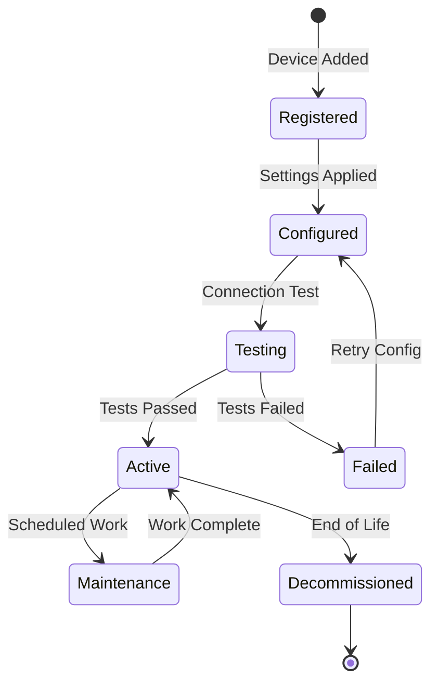

# Device Registry

The device registry maintains configuration and metadata for all physical equipment connected to the Flux platform.

## Device Types

### BESS Devices

Battery Energy Storage Systems are the primary controllable assets:

```typescript
interface BESSDevice {
  id: string;           // UUID
  name: string;         // Human-readable identifier
  type: 'bess';        
  site: string;        // WLCE, HMCE, LFCE
  metadata: {
    manufacturer: string;
    model: string;
    capacity_kwh: number;
    max_power_kw: number;
    efficiency: number;
    modbus_address: number;
    firmware_version: string;
  };
  active: boolean;
  created_at: Date;
  updated_at: Date;
}
```

**Example BESS Registration:**
```sql
INSERT INTO flux.mg_device_registry (
  id, name, type, site, metadata, active
) VALUES (
  '11111111-1111-1111-1111-111111111111',
  'WLCE-BESS-01',
  'bess',
  'WLCE',
  '{
    "manufacturer": "PowerPack",
    "model": "PP-500",
    "capacity_kwh": 500,
    "max_power_kw": 100,
    "efficiency": 0.92,
    "modbus_address": 1,
    "firmware_version": "2.1.3"
  }'::jsonb,
  true
);
```

### Meter Devices

Power meters monitor energy flows at key points:

```typescript
interface MeterDevice {
  id: string;
  name: string;
  type: 'meter';
  site: string;
  metadata: {
    manufacturer: string;
    model: string;
    meter_type: 'grid' | 'generation' | 'load';
    phases: number;
    ct_ratio: number;
    vt_ratio: number;
    modbus_address: number;
    register_map: string;
  };
  active: boolean;
}
```

**Example Meter Registration:**
```sql
INSERT INTO flux.mg_device_registry (
  id, name, type, site, metadata, active
) VALUES (
  '22222222-2222-2222-2222-222222222222',
  'WLCE-GRID-METER',
  'meter',
  'WLCE',
  '{
    "manufacturer": "Accuenergy",
    "model": "Acuvim-II",
    "meter_type": "grid",
    "phases": 3,
    "ct_ratio": 100,
    "vt_ratio": 1,
    "modbus_address": 2,
    "register_map": "acuvim2_standard"
  }'::jsonb,
  true
);
```

## Device Lifecycle

### Registration Flow



### State Transitions

| From State | To State | Trigger | Actions |
|------------|----------|---------|---------|
| Registered | Configured | Config deployment | Update metadata |
| Configured | Testing | First poll attempt | Verify communication |
| Testing | Active | Successful poll | Enable telemetry |
| Testing | Failed | Poll timeout/error | Alert operator |
| Active | Maintenance | Scheduled/Manual | Disable control |
| Active | Decommissioned | Removal | Archive data |

## Device Discovery

### Network Scanning

```python
# scan_devices.py
import minimalmodbus
import socket

def scan_modbus_network(subnet="192.168.1", port=502):
    """Scan network for Modbus devices"""
    devices = []
    
    for host in range(1, 255):
        ip = f"{subnet}.{host}"
        try:
            # Test TCP connection
            sock = socket.socket(socket.AF_INET, socket.SOCK_STREAM)
            sock.settimeout(0.5)
            result = sock.connect_ex((ip, port))
            sock.close()
            
            if result == 0:
                # Try Modbus communication
                for address in range(1, 10):
                    try:
                        instrument = minimalmodbus.Instrument(ip, address)
                        instrument.serial.timeout = 0.5
                        # Try reading holding register 0
                        value = instrument.read_register(0)
                        devices.append({
                            "ip": ip,
                            "port": port,
                            "address": address,
                            "responsive": True
                        })
                        print(f"Found device at {ip}:{port} address {address}")
                    except:
                        pass
        except:
            pass
    
    return devices
```

### Auto-Registration

```go
// auto_register.go
func autoRegisterDevice(ip string, modbusAddr uint8) (*Device, error) {
    // Probe device type
    deviceType := probeDeviceType(ip, modbusAddr)
    
    // Generate registration
    device := &Device{
        ID:   uuid.New(),
        Name: fmt.Sprintf("%s-%s-%d", site, deviceType, modbusAddr),
        Type: deviceType,
        Site: site,
        Metadata: map[string]interface{}{
            "ip_address":     ip,
            "modbus_address": modbusAddr,
            "discovered_at":  time.Now(),
        },
    }
    
    // Register in database
    err := db.RegisterDevice(device)
    return device, err
}
```

## Device Grouping

### Logical Groups

Devices can be organized into logical groups for coordinated control:

```sql
-- Create device groups table
CREATE TABLE flux.device_groups (
    id UUID PRIMARY KEY DEFAULT gen_random_uuid(),
    name TEXT NOT NULL,
    site TEXT NOT NULL,
    group_type TEXT NOT NULL, -- 'control', 'monitoring', 'analysis'
    metadata JSONB,
    created_at TIMESTAMPTZ DEFAULT NOW()
);

-- Device group membership
CREATE TABLE flux.device_group_members (
    group_id UUID REFERENCES flux.device_groups(id),
    device_id UUID REFERENCES flux.mg_device_registry(id),
    role TEXT, -- 'primary', 'backup', 'monitor'
    priority INTEGER,
    PRIMARY KEY (group_id, device_id)
);
```

### Example Groups

```sql
-- BESS fleet for coordinated dispatch
INSERT INTO flux.device_groups (name, site, group_type) 
VALUES ('WLCE-BESS-Fleet', 'WLCE', 'control');

-- Critical meters for settlement
INSERT INTO flux.device_groups (name, site, group_type)
VALUES ('Settlement-Meters', 'ALL', 'monitoring');
```

## Device Health Monitoring

### Health Metrics

```sql
CREATE TABLE flux.device_health (
    device_id UUID REFERENCES flux.mg_device_registry(id),
    timestamp TIMESTAMPTZ NOT NULL,
    status TEXT NOT NULL, -- 'online', 'offline', 'degraded'
    response_time_ms INTEGER,
    error_count INTEGER,
    last_successful_poll TIMESTAMPTZ,
    diagnostics JSONB,
    PRIMARY KEY (device_id, timestamp)
);

-- Convert to hypertable
SELECT create_hypertable('flux.device_health', 'timestamp');
```

### Health Check Implementation

```go
func checkDeviceHealth(device *Device) HealthStatus {
    start := time.Now()
    
    // Attempt communication
    _, err := device.ReadRegister(0)
    responseTime := time.Since(start).Milliseconds()
    
    status := HealthStatus{
        DeviceID:     device.ID,
        Timestamp:    time.Now(),
        ResponseTime: responseTime,
    }
    
    if err != nil {
        status.Status = "offline"
        status.ErrorCount++
    } else if responseTime > 1000 {
        status.Status = "degraded"
    } else {
        status.Status = "online"
        status.LastSuccessfulPoll = time.Now()
    }
    
    return status
}
```

## Device Configuration Management

### Configuration Templates

```yaml
# templates/powerpack_bess.yaml
device_template:
  type: bess
  manufacturer: PowerPack
  default_config:
    polling_interval: 60s
    timeout: 5s
    retry_count: 3
    registers:
      soe: 2026
      target_power: 2008
      status: 2000
      available_blocks: 2028
    scaling:
      power: 1.0
      energy: 0.001
```

### Configuration Deployment

```bash
# Deploy config to all BESS devices
flux devices apply-template \
  --template powerpack_bess.yaml \
  --filter "type=bess,site=WLCE" \
  --commit
```

## Maintenance Mode

### Setting Maintenance Mode

```sql
-- Put device in maintenance
UPDATE flux.mg_device_registry
SET 
  active = false,
  metadata = jsonb_set(
    metadata,
    '{maintenance}',
    '{
      "started_at": "2024-01-01T10:00:00Z",
      "reason": "Firmware upgrade",
      "expected_duration": "2 hours"
    }'::jsonb
  )
WHERE id = 'device-uuid';
```

### Maintenance Notifications

```go
func enterMaintenanceMode(deviceID uuid.UUID, reason string) error {
    // Update registry
    device.Active = false
    device.Metadata["maintenance"] = MaintenanceInfo{
        StartedAt: time.Now(),
        Reason:    reason,
    }
    
    // Stop polling
    controller.DisableDevice(deviceID)
    
    // Send notifications
    notifier.Send(fmt.Sprintf(
        "Device %s entering maintenance: %s",
        device.Name, reason
    ))
    
    return nil
}
```

## Next Steps

- [Domain Model Overview](./) - Return to domain model
- [Database Schema](../database/) - Storage implementation
- [Controller Architecture](../controller/) - Device control logic