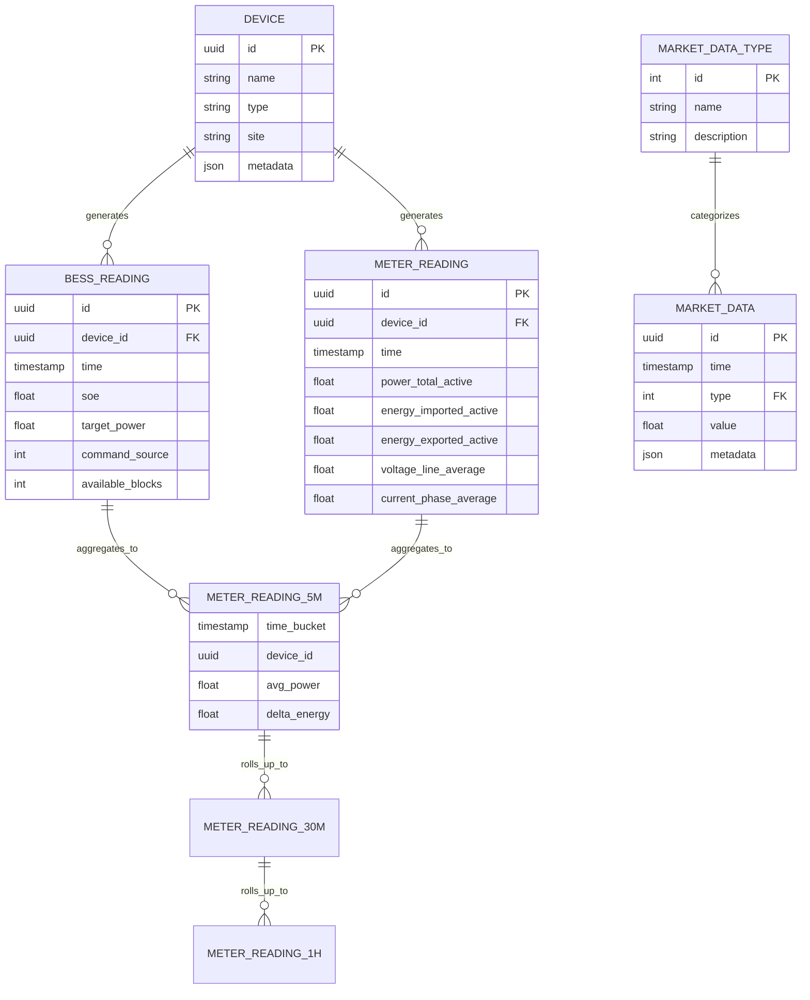
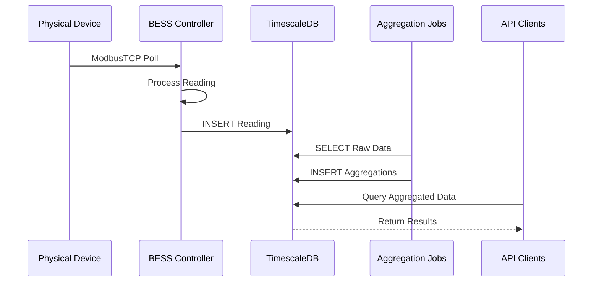

# Flux Domain Model

The Flux platform manages real-time battery control and energy trading through a set of core domain entities. This section describes the key concepts and their relationships.

## Entity Relationship Diagram

## Core Entities

### Devices (`mg_device_registry`)

Represents physical equipment connected to the Flux platform:

| Field | Type | Description |
|-------|------|-------------|
| `id` | UUID | Unique identifier |
| `name` | String | Human-readable device name |
| `type` | String | Device type (bess, meter) |
| `site` | String | Site identifier (WLCE, HMCE, LFCE) |
| `metadata` | JSON | Additional configuration |

**Device Types:**
- **BESS**: Battery Energy Storage Systems (PowerPack)
- **Meter**: Power meters (Acuvim II)

### BESS Readings (`mg_bess_readings`)

High-frequency telemetry from battery systems:

| Field | Type | Description |
|-------|------|-------------|
| `id` | UUID | Reading identifier |
| `device_id` | UUID | BESS device reference |
| `time` | Timestamp | Reading timestamp (UTC) |
| `soe` | Float | State of Energy (0-100%) |
| `target_power` | Float | Commanded power (kW) |
| `command_source` | Integer | Control mode identifier |
| `available_inverter_blocks` | Integer | Available capacity units |

**Command Sources:**
- `0`: Manual/Default
- `1`: NIV Chase
- `2`: Dynamic Peak
- `3`: Import Avoidance
- `4`: Export Avoidance
- `5`: Axle Dispatch

### Meter Readings (`mg_meter_readings`)

Power flow measurements from site meters:

| Field | Type | Description |
|-------|------|-------------|
| `id` | UUID | Reading identifier |
| `device_id` | UUID | Meter device reference |
| `time` | Timestamp | Reading timestamp (UTC) |
| `frequency` | Float | Grid frequency (Hz) |
| `voltage_line_average` | Float | Average line voltage (V) |
| `current_phase_[a\|b\|c]` | Float | Phase currents (A) |
| `power_phase_[a\|b\|c]_active` | Float | Phase active power (kW) |
| `power_total_active` | Float | Total active power (kW) |
| `power_total_reactive` | Float | Total reactive power (kVAR) |
| `power_total_apparent` | Float | Total apparent power (kVA) |
| `power_factor_total` | Float | Power factor |
| `energy_imported_active` | Float | Cumulative import (kWh) |
| `energy_exported_active` | Float | Cumulative export (kWh) |

### Market Data (`market_data`)

External market signals and prices:

| Field | Type | Description |
|-------|------|-------------|
| `id` | UUID | Data point identifier |
| `time` | Timestamp | Data timestamp (UTC) |
| `type` | Integer | Market data type reference |
| `value` | Float | Data value |
| `metadata` | JSON | Additional context |

### Market Data Types (`market_data_types`)

Categories of market information:

| Field | Type | Description |
|-------|------|-------------|
| `id` | Integer | Type identifier |
| `name` | String | Type name |
| `description` | String | Type description |

**Standard Types:**
- `1`: NIV Estimate (MW)
- `2`: Wholesale Price (£/MWh)
- `3`: Imbalance Price (£/MWh)
- `4`: Axle Dispatch (kW)

## Aggregated Views

### 5-Minute Aggregations

Rolled-up telemetry for analysis:

**`mg_meter_readings_5m_intermediate`:**
- Time-bucketed averages of power measurements
- Energy deltas calculated using counter aggregates
- Interpolation for missing data points

**`mg_bess_readings_5m`:**
- Average SOE over period
- Total energy charged/discharged
- Mode utilization statistics

### 30-Minute Aggregations

Settlement period aggregations:

**`mg_meter_readings_30m_intermediate`:**
- Half-hourly energy consumption/generation
- Peak demand within period
- Power factor statistics

### Hourly Aggregations

Long-term analysis views:

**`mg_meter_readings_1h`:**
- Hourly energy totals
- Daily peak tracking
- Monthly accumulations

## Data Flow

## Key Relationships

### Device to Readings
- One-to-many relationship
- Devices generate multiple readings over time
- Unique constraint on (device_id, time) prevents duplicates

### Raw to Aggregated Data
- Continuous aggregation policies
- Automatic roll-up from 1-minute to 5/30/60-minute buckets
- Retention policies for data lifecycle

### Market Data Integration
- Time-series join with telemetry data
- Enables correlation of battery operation with market signals
- Supports backtesting and analysis

## Data Characteristics

### Volume
- ~1,440 readings per device per day (1-minute frequency)
- ~100 MB per site per month
- Automatic compression via TimescaleDB

### Precision
- Timestamps: Microsecond precision
- Power measurements: 0.001 kW resolution
- Energy measurements: 0.01 kWh resolution

### Retention
- Raw data: 90 days
- 5-minute aggregations: 1 year
- 30-minute aggregations: 5 years
- Hourly aggregations: Indefinite

## Next Steps

- [Database Schema](../database/) - Detailed table definitions
- [API Reference](../api/) - Query the domain model
- [Controller Architecture](../controller/) - How data is generated