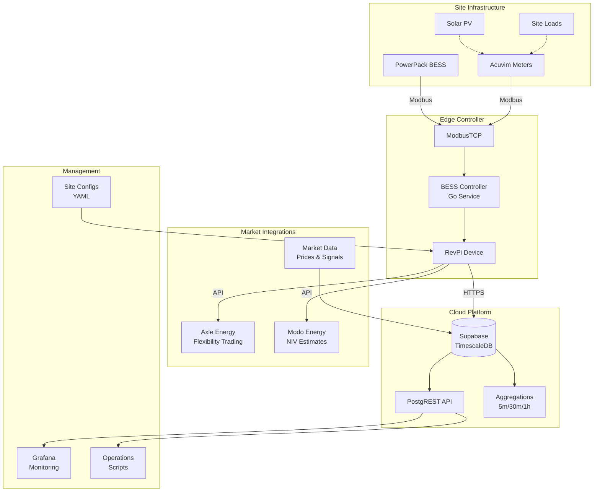

# Flux Platform Overview

Flux is a real-time battery energy storage system (BESS) control platform designed for optimizing energy trading and grid services in microgrids. It provides intelligent battery control, market integration, and telemetry collection capabilities for maximizing the value of distributed energy resources.

## What is Flux?

Flux is the battery control and energy trading platform that:
- Controls battery charge/discharge in real-time based on market signals
- Integrates with energy markets (Axle, Modo) for trading opportunities
- Collects high-frequency telemetry from batteries and meters
- Implements multiple control strategies (NIV chase, peak avoidance, etc.)
- Provides data aggregation and analysis capabilities
- Runs on-site on RevPi industrial controllers

## Architecture Overview

## Key Components

### BESS Controller
The core Go service running on RevPi devices that:
- Polls devices via ModbusTCP every minute
- Executes control algorithms based on configured modes
- Uploads telemetry to Supabase cloud platform
- Integrates with external market platforms
- Manages time-based mode scheduling

### Control Modes
Intelligent control strategies that optimize battery operation:
- **NIV Chase**: Follow Net Imbalance Volume signals for grid balancing
- **Dynamic Peak Avoidance**: Reduce peak demand charges
- **Import/Export Avoidance**: Prevent grid import or export
- **ToSOE**: Target specific State of Energy levels
- **Axle Integration**: Execute market dispatch instructions

### Data Platform
TimescaleDB-powered analytics platform:
- High-frequency telemetry storage (1-minute resolution)
- Automatic data aggregation (5m, 30m, hourly)
- Market data integration (prices, signals)
- RESTful API via PostgREST
- Real-time monitoring via Grafana

### Device Integrations
Communication with physical equipment:
- PowerPack BESS systems via ModbusTCP
- Acuvim II power meters for site monitoring
- Configurable polling intervals
- Automatic reconnection and error handling

## Key Concepts

### Telemetry Data
High-resolution measurements collected every minute:
- **BESS Readings**: SOE, target power, available blocks
- **Meter Readings**: Power, energy, voltage, current, power factor
- **Market Data**: NIV estimates, wholesale prices
- **Aggregations**: Automated roll-ups for analysis

### Site Deployment
Each microgrid site has:
- RevPi industrial controller running BESS Controller
- Site-specific YAML configuration
- VPN connectivity via Emnify
- Systemd service management
- Remote monitoring and updates

### Market Integration
Participation in energy markets:
- Axle Energy for flexibility dispatch
- Modo Energy for NIV forecasts
- Wholesale price signals
- Automated trading execution

## Platform Capabilities

### Real-time Control
- Sub-minute decision making
- Multiple concurrent control objectives
- Priority-based mode selection
- Constraint management (SOE limits, power limits)

### Data Analytics
- Historical analysis of battery performance
- Market opportunity assessment
- Site consumption patterns
- Revenue optimization insights

### Operational Management
- Remote configuration updates
- Health monitoring and alerting
- Gap recovery for missing data
- Performance metrics and KPIs

## Use Cases

- **Grid Services**: Provide frequency response and balancing services
- **Energy Trading**: Capitalize on market price volatility
- **Peak Management**: Reduce demand charges for sites
- **Solar Integration**: Optimize self-consumption of renewable energy
- **Backup Power**: Maintain reserve capacity for outages

## Deployment Sites

Flux is currently deployed at:
- **Water Lilies (WLCE)**: 33 homes with community battery in Bristol
- **Hazelmead (HMCE)**: 54 homes with community battery in Bridport
- **Lovedon Fields (LFCE)**: Community microgrid deployment

## Next Steps

- [Domain Model](./domain-model/) - Understand the data entities
- [Database Schema](./database/) - Explore tables and aggregations
- [Controller Architecture](./controller/) - Learn about control modes
- [Deployment Guide](./deployment/) - Deploy to RevPi devices
- [API Reference](./api/) - Access telemetry data