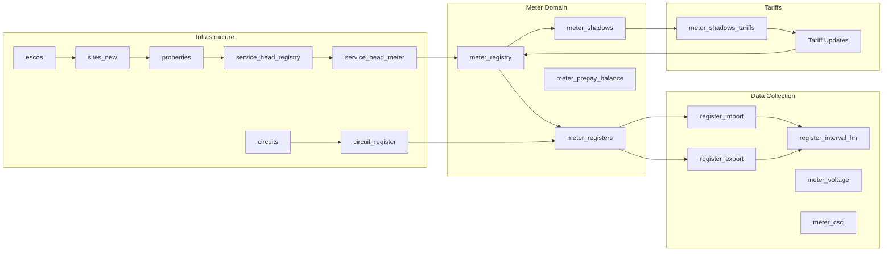

# Flows Domain Model

The Flows platform is organized around several interconnected domains that model the physical and logical aspects of meter data management in microgrids.

## Domain Structure

## Core Domains

### 1. [Meter Domain](./meters.md)
Central to the platform, managing meter configurations, real-time state, and prepayment functionality.

**Key Entities:**
- `meter_registry` - Master meter configuration
- `meter_shadows` - Real-time meter state mirror
- `meter_registers` - Register-to-meter relationships
- `meter_prepay_balance` - Balance tracking over time

### 2. [Data Collection Domain](./data-collection.md)
Handles the continuous flow of consumption data and meter telemetry.

**Key Entities:**
- `register_import/export` - Energy flow measurements
- `register_interval_hh` - Half-hourly consumption data
- `meter_voltage` - Voltage monitoring
- `meter_csq` - Signal quality tracking

### 3. [Infrastructure Domain](./infrastructure.md)
Models the physical and logical topology of the electrical network.

**Key Entities:**
- `circuits` - Electrical circuit definitions
- `service_head_registry` - Connection points
- `properties` - Physical locations
- `sites_new` - Site groupings
- `escos` - Energy service companies

### 4. [Tariffs Domain](./tariffs.md)
Manages pricing structures and meter tariff updates.

**Key Entities:**
- `meter_shadows_tariffs` - Current and future tariffs
- Tariff update workflows
- Prepayment token management

## Entity Relationships

### Primary Keys and Foreign Keys

The domain model uses UUIDs as primary keys for most entities, providing:
- Globally unique identifiers
- Decoupled ID generation
- Better distribution for indexing

### Time-Series Data

Many entities use TimescaleDB hypertables for efficient time-series storage:
- `register_interval_hh` - Partitioned by timestamp
- `meter_voltage` - Continuous monitoring data
- `meter_prepay_balance` - Balance history

### Aggregation Views

The platform provides pre-computed views for common aggregations:
- `circuit_interval_daily` - Daily circuit consumption
- `circuit_interval_monthly` - Monthly aggregates
- `meters_offline_recently` - Health monitoring

## Data Flow

1. **Meter Communication** → Mediator servers poll meters
2. **Data Collection** → Readings stored in register tables
3. **Synchronization** → meter_shadows updated with latest state
4. **Aggregation** → Views compute circuit and property totals
5. **API Access** → PostgREST exposes data to applications

## Design Principles

### Event Sourcing
Many operations are logged as events:
- `meter_event_log` - All meter events
- Balance changes tracked over time
- Tariff updates maintain history

### Digital Twin Pattern
`meter_shadows` acts as a digital twin of physical meters:
- Mirrors real-time meter state
- Enables offline analysis
- Supports passive monitoring mode

### Separation of Concerns
- **Physical topology** (circuits, service heads) separated from **logical grouping** (properties, sites)
- **Configuration** (meter_registry) separated from **state** (meter_shadows)
- **Raw data** (register readings) separated from **aggregations** (interval views)

## Next Steps

Explore each domain in detail:
- [Meter Domain](./meters.md) - Core meter management
- [Data Collection](./data-collection.md) - Consumption and telemetry
- [Infrastructure](./infrastructure.md) - Physical topology
- [Tariffs](./tariffs.md) - Pricing and billing support