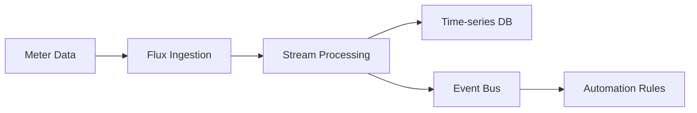

# Flux Platform

Real-time data processing and streaming platform for energy management.

## Overview

Flux handles real-time data processing for the Simtricity platform, including:

- Real-time meter data ingestion
- Stream processing and aggregation
- Event-driven automation
- Time-series data management

## Architecture

## Key Features

- **High Throughput** - Process millions of meter readings per day
- **Low Latency** - Sub-second processing times
- **Scalable** - Horizontal scaling capabilities
- **Reliable** - Guaranteed message delivery

## Coming Soon

Detailed documentation for Flux is currently being developed. Check back soon for:

- Installation guides
- API documentation
- Configuration examples
- Best practices

## Contact

For early access or more information about Flux, please contact our support team.