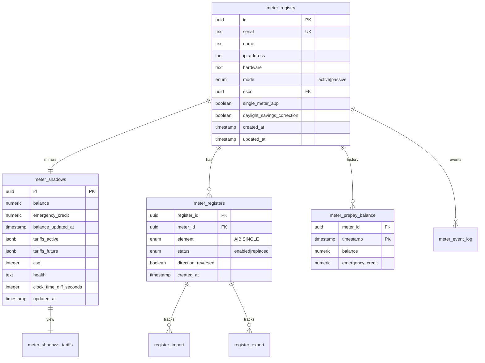

# Meter Domain

The Meter Domain is the heart of the Flows platform, managing prepayment meter configurations, real-time state synchronization, and balance tracking.

## Entity Relationship Diagram



## Core Entities

### meter_registry

The master configuration table for all meters in the system.

**Key Fields:**
- `id` - UUID primary key
- `serial` - Unique meter serial number (e.g., "EML2137580826")
- `name` - Human-readable name
- `ip_address` - Network address for communication
- `hardware` - Hardware version/model
- `mode` - `active` (real meter) or `passive` (digital twin)
- `esco` - Energy service company ownership
- `single_meter_app` - Whether meter runs single app mode
- `daylight_savings_correction_enabled` - BST timezone handling

**Usage:**
```sql
-- Find all active meters for an ESCO
SELECT id, serial, name, ip_address
FROM flows.meter_registry
WHERE mode = 'active' 
  AND esco = '{{esco_id}}'
ORDER BY name;
```

### meter_shadows

Real-time mirror of meter state, updated by sync jobs.

**Key Fields:**
- `id` - Links to meter_registry
- `balance` - Current prepayment balance (£)
- `emergency_credit` - Emergency credit limit (£)
- `balance_updated_at` - Last balance update time
- `tariffs_active` - Current active tariff (JSON)
- `tariffs_future` - Scheduled future tariff (JSON)
- `csq` - Cellular signal quality (0-31)
- `health` - `healthy` or `unhealthy`
- `clock_time_diff_seconds` - Clock drift from server time

**Tariff JSON Structure:**
```json
{
  "standing_charge": 0.5868,
  "unit_rate_element_a": 0.2843,
  "unit_rate_element_b": 0.1500,
  "prepayment_ecredit_availability": 10.00,
  "prepayment_debt_recovery_rate": 0.25,
  "prepayment_emergency_credit": 15.00,
  "activation_datetime": "2024-10-01T00:00:00"
}
```

### meter_registers

Maps registers to meters, supporting single and dual-element configurations.

**Key Fields:**
- `register_id` - UUID of the register
- `meter_id` - Parent meter UUID
- `element` - `A`, `B`, or `SINGLE`
- `status` - `enabled` or `replaced`
- `direction_reversed` - Whether import/export is reversed

**Patterns:**
- Single-rate meters have one register with element=`SINGLE`
- Dual-rate meters have two registers: element=`A` (day) and element=`B` (night)
- Solar meters may have reversed direction for export measurement

### meter_prepay_balance

Time-series history of prepayment balance changes.

**Key Fields:**
- `meter_id` - Meter UUID
- `timestamp` - Time of balance reading
- `balance` - Balance at this time
- `emergency_credit` - Emergency credit setting

**Usage:**
```sql
-- Get balance history for last 7 days
SELECT timestamp, balance, emergency_credit
FROM flows.meter_prepay_balance
WHERE meter_id = '{{meter_id}}'
  AND timestamp > NOW() - INTERVAL '7 days'
ORDER BY timestamp DESC;
```

## Views

### meter_shadows_tariffs

Denormalized view of active and future tariffs for easy querying.

**Fields:**
- All fields from meter_shadows
- `active_standing_charge` - Current standing charge
- `active_unit_rate_a` - Current Element A rate
- `active_unit_rate_b` - Current Element B rate
- `active_ecredit_availability` - Emergency credit availability
- `future_standing_charge` - Scheduled standing charge
- `future_unit_rate_a` - Scheduled Element A rate
- `future_activation_datetime` - When future tariff activates

### meters_low_balance

Identifies meters with low prepayment balance.

```sql
SELECT * FROM flows.meters_low_balance
WHERE balance < 5.00;  -- Meters under £5
```

### meters_offline_recently

Tracks meters that have recently gone offline.

```sql
SELECT serial, last_online, 
       EXTRACT(EPOCH FROM (NOW() - last_online))/60 as minutes_offline
FROM flows.meters_offline_recently
WHERE last_online < NOW() - INTERVAL '1 hour';
```

## Common Operations

### 1. Get Meter Status
```sql
SELECT 
    mr.serial,
    mr.name,
    ms.balance,
    ms.health,
    ms.csq,
    ms.updated_at
FROM flows.meter_registry mr
JOIN flows.meter_shadows ms ON mr.id = ms.id
WHERE mr.serial = 'EML2137580826';
```

### 2. Update Meter Tariff
The tariff update process:
1. Update `tariffs_future` in meter_shadows
2. Sync job pushes to physical meter
3. On activation, moves to `tariffs_active`

### 3. Track Balance Changes
```sql
-- Daily balance summary
SELECT 
    DATE(timestamp) as day,
    MIN(balance) as min_balance,
    MAX(balance) as max_balance,
    AVG(balance) as avg_balance
FROM flows.meter_prepay_balance
WHERE meter_id = '{{meter_id}}'
  AND timestamp > NOW() - INTERVAL '30 days'
GROUP BY DATE(timestamp)
ORDER BY day DESC;
```

## Integration Points

### With simt-emlite
- `emop` CLI reads/writes meter data
- Mediator servers sync meter_shadows
- Prepayment tokens applied via EMOP protocol

### With Data Collection
- meter_registers links to register_import/export
- Balance changes trigger meter_prepay_balance inserts
- CSQ and voltage tracked in separate tables

### With Infrastructure
- meter_registry.esco links to escos table
- service_head_meter maps meters to connection points

## Best Practices

1. **Always check meter mode** - Only `active` meters communicate with hardware
2. **Use meter_shadows for current state** - It's the source of truth for real-time data
3. **Track balance history** - Important for audit and customer service
4. **Monitor health and CSQ** - Early warning for communication issues
5. **Handle clock drift** - Use clock_time_diff_seconds to detect time sync problems