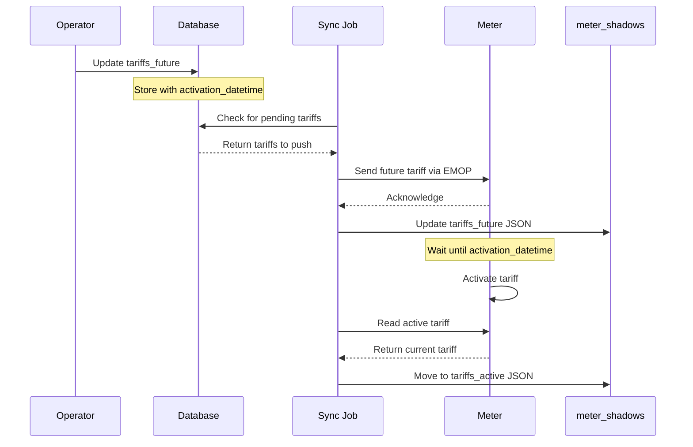

# Tariffs Domain

The Tariffs Domain manages electricity pricing, meter tariff updates, and prepayment token processing. It ensures meters have correct rates and handles the complex workflow of tariff changes.

## Tariff Update Flow



## Core Components

### meter_shadows Tariff Fields

Tariffs are stored as JSON in meter_shadows:

**tariffs_active** - Currently active tariff on the meter:
```json
{
  "standing_charge": 0.5868,
  "unit_rate_element_a": 0.2843,
  "unit_rate_element_b": 0.1500,
  "prepayment_ecredit_availability": 10.00,
  "prepayment_debt_recovery_rate": 0.25,
  "prepayment_emergency_credit": 15.00
}
```

**tariffs_future** - Scheduled tariff update:
```json
{
  "standing_charge": 0.6556,
  "unit_rate_element_a": 0.2798,
  "unit_rate_element_b": 0.1400,
  "prepayment_ecredit_availability": 10.00,
  "prepayment_debt_recovery_rate": 0.25,
  "prepayment_emergency_credit": 15.00,
  "activation_datetime": "2025-01-01T00:00:00"
}
```

### meter_shadows_tariffs View

Denormalized view for easier querying:

```sql
-- View definition extracts JSON fields
CREATE VIEW flows.meter_shadows_tariffs AS
SELECT 
    ms.id,
    mr.serial,
    -- Active tariff fields
    (tariffs_active->>'standing_charge')::numeric as active_standing_charge,
    (tariffs_active->>'unit_rate_element_a')::numeric as active_unit_rate_a,
    (tariffs_active->>'unit_rate_element_b')::numeric as active_unit_rate_b,
    (tariffs_active->>'prepayment_ecredit_availability')::numeric as active_ecredit_availability,
    (tariffs_active->>'prepayment_debt_recovery_rate')::numeric as active_debt_recovery_rate,
    (tariffs_active->>'prepayment_emergency_credit')::numeric as active_emergency_credit,
    -- Future tariff fields
    (tariffs_future->>'standing_charge')::numeric as future_standing_charge,
    (tariffs_future->>'unit_rate_element_a')::numeric as future_unit_rate_a,
    (tariffs_future->>'unit_rate_element_b')::numeric as future_unit_rate_b,
    (tariffs_future->>'activation_datetime')::timestamp as future_activation_datetime,
    (tariffs_future->>'prepayment_ecredit_availability')::numeric as future_ecredit_availability,
    (tariffs_future->>'prepayment_debt_recovery_rate')::numeric as future_debt_recovery_rate,
    (tariffs_future->>'prepayment_emergency_credit')::numeric as future_emergency_credit
FROM flows.meter_shadows ms
JOIN flows.meter_registry mr ON ms.id = mr.id;
```

## Tariff Components

### Unit Rates
- **Element A**: Primary rate (usually day rate)
- **Element B**: Secondary rate (usually night/off-peak)
- **Single Element**: For single-rate meters, only Element A is used
- Rates in pounds per kWh (e.g., 0.2843 = 28.43p/kWh)

### Standing Charge
- Daily fixed charge in pounds
- Applied regardless of consumption
- Typically 40-75p per day

### Prepayment Settings
- **Emergency Credit**: Amount available when balance reaches zero (£)
- **Credit Availability**: Threshold for emergency credit activation (£)
- **Debt Recovery Rate**: Daily amount deducted for debt repayment (£)

### Activation Timing
- **activation_datetime**: When future tariff becomes active
- Uses meter's local time (BST/GMT handling via daylight_savings_correction_enabled)
- Typically set for midnight on quarter boundaries

## Common Operations

### 1. Update Meter Tariffs
```sql
-- Set future tariff for a meter
UPDATE flows.meter_shadows
SET tariffs_future = jsonb_build_object(
    'standing_charge', 0.6556,
    'unit_rate_element_a', 0.2798,
    'unit_rate_element_b', 0.1400,
    'prepayment_ecredit_availability', 10.00,
    'prepayment_debt_recovery_rate', 0.25,
    'prepayment_emergency_credit', 15.00,
    'activation_datetime', '2025-01-01T00:00:00'
)
WHERE id = '{{meter_id}}';
```

### 2. Check Tariff Status
```sql
-- View current and future tariffs
SELECT 
    serial,
    active_unit_rate_a,
    active_standing_charge,
    future_unit_rate_a,
    future_standing_charge,
    future_activation_datetime
FROM flows.meter_shadows_tariffs
WHERE serial = 'EML2137580826';
```

### 3. Find Meters Needing Updates
```sql
-- Meters without future tariffs set
SELECT 
    mr.serial,
    mr.name,
    mst.active_unit_rate_a,
    mst.future_activation_datetime
FROM flows.meter_shadows_tariffs mst
JOIN flows.meter_registry mr ON mst.id = mr.id
WHERE mst.future_activation_datetime IS NULL
   OR mst.future_activation_datetime < NOW()
ORDER BY mr.serial;
```

### 4. Bulk Tariff Update
```sql
-- Update all meters for an ESCO
UPDATE flows.meter_shadows ms
SET tariffs_future = jsonb_build_object(
    'standing_charge', 0.6556,
    'unit_rate_element_a', 0.2798,
    'unit_rate_element_b', 0.1400,
    'prepayment_ecredit_availability', 10.00,
    'prepayment_debt_recovery_rate', 0.25,
    'prepayment_emergency_credit', 15.00,
    'activation_datetime', '2025-01-01T00:00:00'
)
FROM flows.meter_registry mr
WHERE ms.id = mr.id
  AND mr.esco = '{{esco_id}}'
  AND mr.mode = 'active';
```

## Prepayment Tokens

### Token Generation
Prepayment tokens are 20-digit codes that add credit to meters:

```bash
# Generate token using emop CLI
emop prepay_generate_token \
  --amount 20.00 \
  --meter EML2137580826
```

### Token Application
```bash
# Send token to meter
emop prepay_send_token EML2137580826 "12345678901234567890"
```

### Token Tracking
Monitor token application and balance changes:

```sql
-- Recent balance changes
SELECT 
    timestamp,
    balance,
    LAG(balance) OVER (ORDER BY timestamp) as prev_balance,
    balance - LAG(balance) OVER (ORDER BY timestamp) as change
FROM flows.meter_prepay_balance
WHERE meter_id = '{{meter_id}}'
  AND timestamp > NOW() - INTERVAL '7 days'
ORDER BY timestamp DESC;
```

## Tariff Management Workflow

### Quarterly Tariff Updates

1. **Ofgem publishes rates** (5-7 weeks before quarter)
2. **Operator calculates tariffs** with any discounts
3. **Database update** via sync job
4. **Meter programming** with future tariff
5. **Automatic activation** at specified datetime
6. **Verification** via meter_shadows sync

### Monitoring and Alerts

```sql
-- Check for tariff sync issues
WITH tariff_status AS (
    SELECT 
        mr.serial,
        mr.name,
        CASE 
            WHEN mst.future_activation_datetime IS NULL THEN 'No future tariff'
            WHEN mst.future_activation_datetime < NOW() THEN 'Overdue activation'
            WHEN mst.future_activation_datetime < NOW() + INTERVAL '7 days' THEN 'Activating soon'
            ELSE 'OK'
        END as status,
        mst.future_activation_datetime
    FROM flows.meter_shadows_tariffs mst
    JOIN flows.meter_registry mr ON mst.id = mr.id
    WHERE mr.mode = 'active'
)
SELECT status, COUNT(*), array_agg(serial ORDER BY serial) as meters
FROM tariff_status
GROUP BY status;
```

## Integration with simt-emlite

### CLI Commands
```bash
# Read current tariff
emop tariffs_active_read EML2137580826

# Read future tariff
emop tariffs_future_read EML2137580826

# Write future tariff
emop tariffs_future_write \
  --from-ts "2025-01-01T00:00:00" \
  --unit-rate "0.2798" \
  --standing-charge "0.6556" \
  --ecredit-availability "10.0" \
  --debt-recovery-rate "0.25" \
  --emergency-credit "15.00" \
  EML2137580826
```

### Python API
```python
from simt_emlite import MeterClient

client = MeterClient()
meter = client.get_meter("EML2137580826")

# Read tariff
current_tariff = meter.tariffs_active_read()
future_tariff = meter.tariffs_future_read()

# Update tariff
meter.tariffs_future_write(
    activation_datetime="2025-01-01T00:00:00",
    unit_rate_a=0.2798,
    standing_charge=0.6556,
    emergency_credit=15.00
)
```

## Best Practices

### 1. Always Set Future Tariffs
- Never update active tariffs directly on meter
- Use future tariffs with appropriate activation time
- Allow at least 24 hours for activation

### 2. Verify Updates
```sql
-- Check tariff push success
SELECT 
    mr.serial,
    ms.updated_at,
    mst.future_activation_datetime,
    EXTRACT(EPOCH FROM (NOW() - ms.updated_at))/3600 as hours_since_update
FROM flows.meter_registry mr
JOIN flows.meter_shadows ms ON mr.id = ms.id
JOIN flows.meter_shadows_tariffs mst ON mst.id = mr.id
WHERE mst.future_activation_datetime IS NOT NULL
  AND ms.updated_at < NOW() - INTERVAL '1 hour'
ORDER BY ms.updated_at;
```

### 3. Handle DST Correctly
- Check `daylight_savings_correction_enabled` flag
- Use appropriate timezone for activation_datetime
- Test transitions at clock change dates

### 4. Monitor Emergency Credit
```sql
-- Meters using emergency credit
SELECT 
    mr.serial,
    ms.balance,
    ms.emergency_credit,
    mst.active_ecredit_availability
FROM flows.meter_registry mr
JOIN flows.meter_shadows ms ON mr.id = ms.id
JOIN flows.meter_shadows_tariffs mst ON mst.id = mr.id
WHERE ms.balance <= 0
  AND ms.balance >= -ms.emergency_credit;
```

## Troubleshooting

### Tariff Not Activating
1. Check activation_datetime is in the past
2. Verify meter clock synchronization
3. Confirm DST settings match expectation
4. Review meter_event_log for errors

### Inconsistent Tariffs
```sql
-- Find mismatched tariffs
SELECT 
    mr.serial,
    mst.active_unit_rate_a,
    mst.future_unit_rate_a,
    ms.updated_at
FROM flows.meter_shadows_tariffs mst
JOIN flows.meter_shadows ms ON mst.id = ms.id
JOIN flows.meter_registry mr ON mr.id = ms.id
WHERE mst.future_activation_datetime < NOW()
  AND mst.future_unit_rate_a IS NOT NULL
  AND mst.active_unit_rate_a != mst.future_unit_rate_a;
```

### Balance Discrepancies
- Check debt_recovery_rate application
- Verify standing charge calculation
- Review emergency credit settings
- Audit token application history