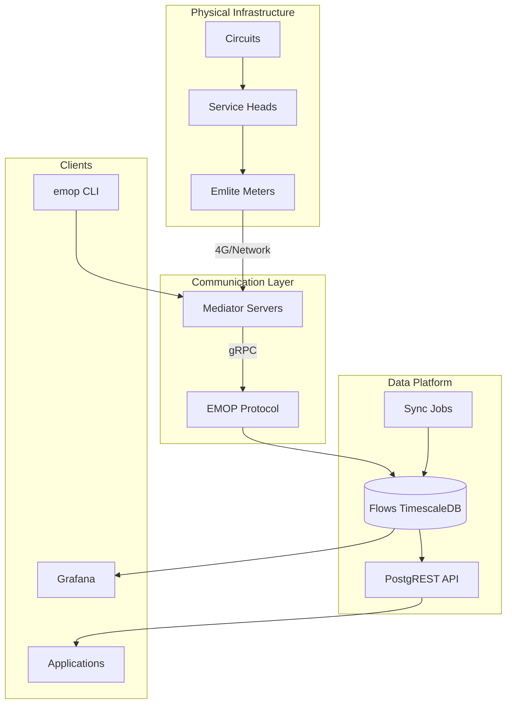

# Flows Platform Overview

Flows is a comprehensive meter data management platform designed for prepayment electricity meters in microgrids and energy communities. It provides real-time meter communication, consumption tracking, tariff management, and data aggregation capabilities.

## What is Flows?

Flows is the core data platform that:
- Manages Emlite prepayment meter configurations and communications
- Collects and stores half-hourly consumption data
- Handles tariff updates and prepayment token processing
- Provides APIs for meter operations and data access
- Aggregates consumption data by circuit, property, and site

## Architecture Overview

## Key Concepts

### Meters
Prepayment electricity meters (primarily Emlite) that measure consumption and manage customer credit. Each meter has:
- One or two registers (Element A/B for dual-rate tariffs)
- Prepayment balance and emergency credit
- Active and future tariff configurations
- Real-time communication via 4G/network

### Registers
Measurement points within a meter that track:
- Import (consumption) readings
- Export (generation) readings for solar
- Half-hourly interval data
- Direction reversal configuration

### Circuits
Logical groupings of electrical loads:
- **Power**: Standard electrical circuits
- **Heat**: Heat pump or heating circuits
- **Solar**: Solar generation circuits

### Service Heads
Physical electrical connection points that:
- Connect properties to the distribution network
- Link meters to properties
- Define the electrical topology

### ESCOs
Energy Service Companies that operate microgrids:
- Manage groups of meters and properties
- Define tariff structures
- Handle billing and customer relationships

## Platform Components

### 1. Database (TimescaleDB)
- Time-series optimized PostgreSQL
- Stores meter readings, events, and configurations
- Provides views for data aggregation
- Handles high-frequency interval data

### 2. Flows CLI Tools (simt-emlite)
- **emop** - Direct meter operations via EMOP protocol
- **mediators** - Manage communication servers
- Python package for programmatic access
- Reliable 4G/network communication

### 3. APIs
- PostgREST for RESTful database access
- RPC functions for complex operations
- Real-time data synchronization
- Authentication and authorization

### 4. Data Processing
- Automated sync jobs
- Interval data aggregation
- Tariff update workflows
- Health monitoring

## Use Cases

- **Meter Operations**: Read consumption, update tariffs, send tokens
- **Data Analysis**: Query historical consumption, generate reports
- **Monitoring**: Track meter health, detect issues
- **Integration**: Build applications using the API
- **Billing Support**: Access consumption data for billing calculations

## Next Steps

- [Domain Model](./domain-model/) - Understand the data entities
- [Database Schema](./database/) - Explore tables and relationships
- [API Reference](./api/) - Learn about API endpoints
- [Developer Guides](./guides/) - Common workflows and examples